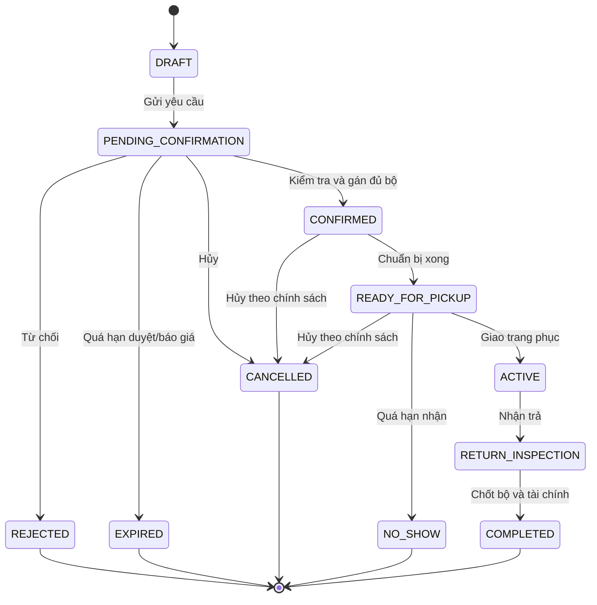
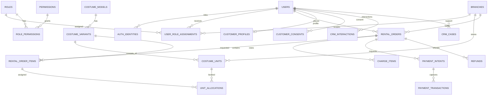
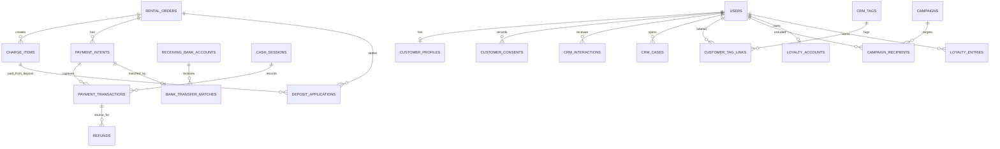
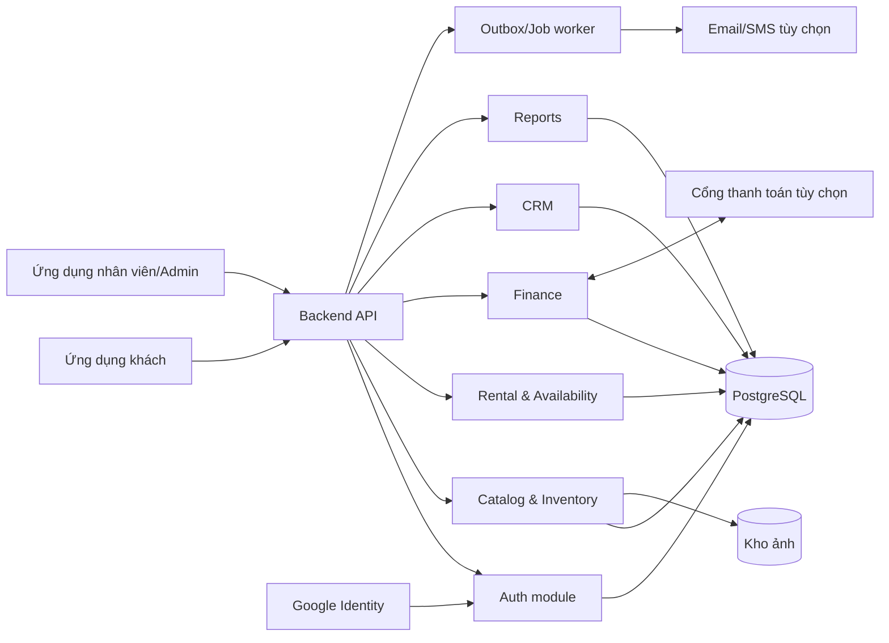
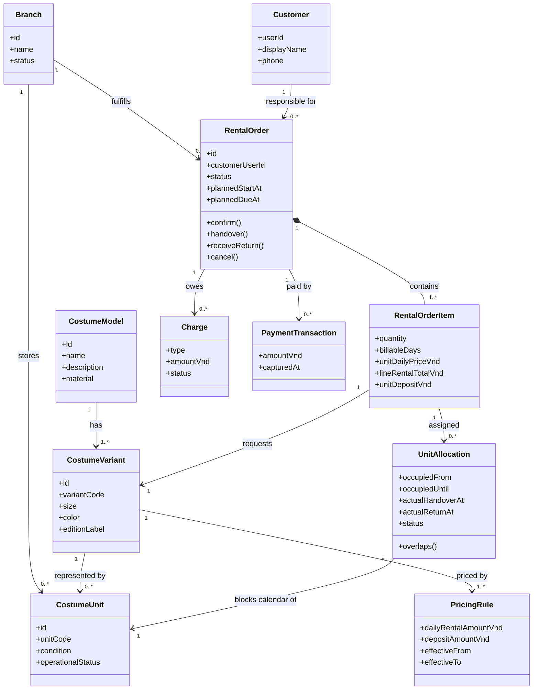
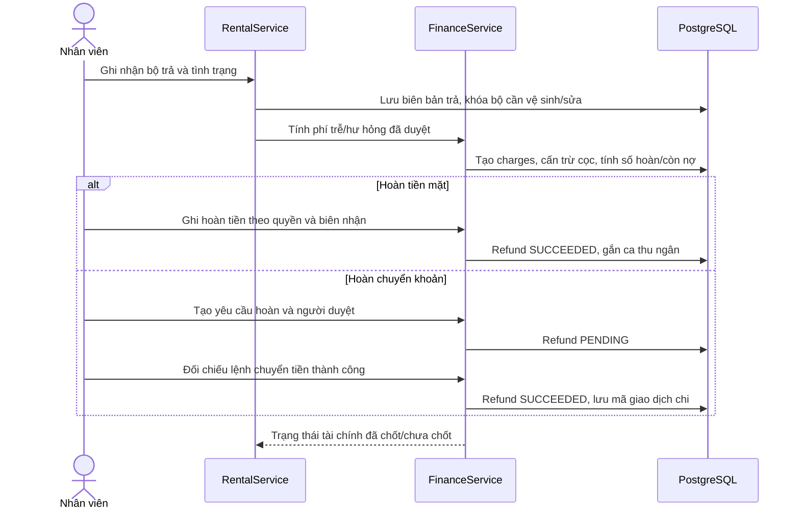

# Phân tích nghiệp vụ và thiết kế hệ thống studio cho thuê trang phục

**Phiên bản:** 1.0 — 25/09/2026

**Mục đích:** tài liệu BA/OOAD để trao đổi với giảng viên, chủ studio và nhóm phát triển.

**Phạm vi đã xác nhận:** chỉ cho thuê trang phục; vận hành theo chuỗi chi nhánh; có Admin, Nhân viên, Customer; quyền thao tác được tick chọn trên giao diện; hỗ trợ đăng nhập Google; khách đặt online hoặc nhân viên lập đơn tại quầy; đơn online được nhân viên duyệt trước khi xác nhận; quản lý từng bộ trang phục bằng mã riêng; nhận/trả tại cùng chi nhánh; giá thuê tính theo ngày; tiền thuê và tiền cọc thu khi giao trang phục bằng tiền mặt hoặc chuyển khoản; hoàn phần cọc còn lại sau khi nhân viên kiểm tra đồ trả.

## 1. Quyết định đã chốt và giả định cần xác nhận

Các mục đã được người dùng xác nhận được đánh dấu **Đã chốt**. Các mục còn lại là **Giả định thiết kế** để hoàn thiện bản vẽ, cần chốt trước khi triển khai:

| Mã | Trạng thái | Quyết định/giả định | Ảnh hưởng nếu thay đổi |
|---|---|---|---|
| A1 | **Đã chốt** | Khách đặt online hoặc nhân viên lập đơn tại quầy | Có hai kênh tạo đơn cùng dùng chung quy tắc thuê |
| A2 | **Đã chốt** | Mỗi bộ trang phục vật lý có mã/barcode riêng, thuộc một chi nhánh tại một thời điểm | Là nền của kiểm soát lịch, vệ sinh, hư hỏng và điều chuyển |
| A3 | **Đã chốt** | Khách nhận và trả tại cùng chi nhánh; không giao hàng trong phạm vi hiện tại | Nếu sau này trả khác chi nhánh, phải thêm điều phối vận chuyển và đối soát tồn |
| A4 | **Đã chốt** | Thu tiền thuê và tiền cọc qua tiền mặt hoặc chuyển khoản; cổng thanh toán online chưa nằm trong phạm vi hiện tại | Tích hợp cổng là phần mở rộng; mức cọc còn cần chốt |
| A5 | **Đã chốt** | Đơn online phải được nhân viên duyệt rồi mới xác nhận | Cần hàng đợi đơn chờ và quyền duyệt tại chi nhánh |
| A6 | **Đã yêu cầu đề xuất đầy đủ** | CRM được thiết kế cả hồ sơ, lịch sử thuê, chăm sóc, khiếu nại, phân khúc, chiến dịch và tích điểm | Phạm vi triển khai từng giai đoạn còn cần studio chốt |
| A7 | **Phương án đề xuất được dùng** | Đơn chờ duyệt chưa giữ bộ; bộ chỉ được gán khi nhân viên xác nhận | Nếu muốn giữ tạm, cần thời hạn giữ, hết hạn tự giải phóng và xử lý thanh toán |
| A8 | **Đã chốt** | Giá thuê theo ngày; tiền thuê và tiền cọc thu lúc khách nhận đồ | Cần chốt một ngày tính theo 24 giờ hay ngày lịch và quy tắc làm tròn/trả trễ |
| A9 | **Đã chốt** | Nhân viên kiểm tra tình trạng từng bộ khi khách trả; sau khi tính phí/cấn trừ mới hoàn phần cọc còn lại | Không hoàn cọc ngay khi chỉ vừa ghi nhận đồ đã trả |

Các mức tiền, thời hạn hủy, số ngày thuê, thời gian giặt là, phí trễ/hư hỏng và thời gian giữ đơn **không được hardcode trong chương trình**. Mục 19 đề xuất giá trị khởi đầu; hệ thống lưu chúng thành chính sách có phiên bản và cho người có quyền cấu hình.

## 2. Bối cảnh và mục tiêu kinh doanh

Một chuỗi studio có nhiều chi nhánh, mỗi nơi giữ các bộ trang phục khác nhau. Khách cần biết mẫu/size còn khả dụng cho lịch thuê mong muốn. Nhân viên cần xác nhận đơn, giao trang phục, nhận trả, kiểm tra tình trạng và quyết toán. Quản trị viên cần nhìn toàn chuỗi và điều chỉnh quyền nhân viên theo vị trí/chi nhánh mà không sửa mã nguồn.

### Mục tiêu đo được

- Không xác nhận hai đơn dùng cùng một bộ trong hai khoảng thời gian chồng lấn.
- Biết một bộ đang ở chi nhánh nào, đang thuê, vệ sinh, sửa chữa hay ngừng khai thác.
- Theo dõi từng khoản phải thu, đã thu, cọc đang giữ, cần hoàn và khoản còn nợ.
- Xem doanh thu và mức sử dụng theo chi nhánh, mẫu, thời gian và kênh bán.
- Xem lịch sử khách để chăm sóc đúng ngữ cảnh, có lưu lựa chọn nhận thông tin marketing.
- Truy vết ai đã đổi quyền, giá, trạng thái đơn và tình trạng trang phục.

### Ngoài phạm vi

Không có chụp ảnh, trang điểm, thuê phòng hoặc bán sản phẩm. Nếu bổ sung sau này, nên tạo phân hệ dịch vụ riêng thay vì lồng vào logic thuê trang phục.

## 3. Tác nhân, phạm vi dữ liệu và trách nhiệm

| Nhóm tài khoản | Công việc | Giới hạn mặc định |
|---|---|---|
| **Customer** | Xem trang phục, đặt thuê, xem/hủy đơn của mình, cập nhật hồ sơ, xem hóa đơn/biên nhận | Chỉ bản ghi thuộc chính mình |
| **Nhân viên** | Xử lý đơn, giao nhận, chăm sóc khách, thu tiền, kiểm kê hoặc quản lý chi nhánh tùy quyền được tick | Chỉ chi nhánh được phân công; quyền thao tác có thể khác nhau |
| **Admin** | Quản trị chi nhánh, tài khoản, giá/chính sách, phân quyền, báo cáo toàn chuỗi | Toàn chuỗi theo bộ quyền được cấp |

**Không cần hardcode các vai trò “thu ngân”, “thủ kho”, “quản lý chi nhánh”.** Đây là các bộ quyền mẫu thuộc nhóm Nhân viên. Một người có thể được gán nhiều chi nhánh với quyền khác nhau. Người vừa là khách vừa là nhân viên có một tài khoản, nhưng quyền khách và quyền nghiệp vụ được kiểm tra theo từng hành động.

Các tác nhân ngoài hệ thống: Google cung cấp danh tính đăng nhập; cổng thanh toán (nếu dùng) gửi kết quả giao dịch; dịch vụ SMS/email (nếu dùng) gửi thông báo theo lựa chọn của khách.

## 4. Danh mục nghiệp vụ và yêu cầu chức năng

| Mã | Phân hệ | Chức năng bắt buộc/đề xuất |
|---|---|---|
| FR-01 | Xác thực | Đăng nhập Google, phiên đăng nhập nội bộ, đăng xuất, khóa/mở tài khoản, liên kết tài khoản |
| FR-02 | Chi nhánh | Tạo/sửa chi nhánh, địa chỉ, giờ làm việc, trạng thái, cấu hình nhận/trả |
| FR-03 | Nhân sự | Mời nhân viên, gán một/nhiều chi nhánh, ngừng phân công, xem lịch sử thay đổi |
| FR-04 | Phân quyền | Danh mục quyền, bộ quyền mẫu, ma trận checkbox, ngoại lệ theo nhân viên/chi nhánh, nhật ký |
| FR-05 | Danh mục | Mẫu, biến thể size/màu, ảnh, **mô tả chi tiết**, phụ kiện, đơn giá/ngày, tiền cọc, phân loại, tình trạng hiển thị |
| FR-06 | Tài sản | Mã bộ/barcode, chi nhánh hiện tại, tình trạng vật lý, giá mua, lịch sử vòng đời |
| FR-07 | Giá/chính sách | Giá theo thời gian thuê, tiền cọc, ưu đãi, phí trễ, bồi thường, thời gian chuẩn bị/vệ sinh, hủy đơn |
| FR-08 | Khả dụng | Tìm bộ trống lịch theo chi nhánh, biến thể và thời gian; không tính bộ đang vệ sinh/sửa |
| FR-09 | Đơn thuê | Tạo tại quầy/online, ghi **số ngày thuê và người thuê**, báo giá, xác nhận/từ chối/hủy, gán bộ, cập nhật trạng thái |
| FR-10 | Giao nhận | Biên bản giao, checklist phụ kiện/tình trạng, biên bản trả, bằng chứng ảnh nếu dùng |
| FR-11 | Thanh toán | Khoản phải thu, thu tiền thuê/cọc, ghi nhận thanh toán, phụ thu, hoàn cọc, đối soát |
| FR-12 | Kho/điều chuyển | Nhập bộ, chuyển giữa chi nhánh, kiểm kê, vệ sinh, sửa chữa, ngừng khai thác |
| FR-13 | CRM | Hồ sơ khách, lịch sử thuê và tương tác, ghi chú, nhãn, phản hồi, đồng ý marketing |
| FR-14 | Báo cáo | Đơn, doanh thu, cọc chưa tất toán, quá hạn, mức sử dụng, hư hỏng, khách quay lại |
| FR-15 | Kiểm soát | Audit log, thông báo nghiệp vụ, sao lưu, đối soát thay đổi nhạy cảm |
| FR-16 | Theo dõi đang thuê | Tra cứu theo khách, số điện thoại, mã đơn hoặc mã bộ; xem ai đang giữ từng bộ, giờ giao, hạn trả, quá hạn và tình trạng cọc |
| FR-17 | Quản lý giá | Người có quyền sửa giá thuê/ngày và cọc trên giao diện theo biến thể/chi nhánh/ngày hiệu lực; đơn cũ giữ giá đã chốt |

### Use case cốt lõi

| ID | Tác nhân chính | Use case | Tiền điều kiện | Kết quả thành công |
|---|---|---|---|---|
| UC-01 | Khách/Nhân viên/Admin | Đăng nhập Google | Tài khoản Google hợp lệ | Có phiên nội bộ, quyền được nạp từ hệ thống |
| UC-02 | Khách/Nhân viên | Tìm khả dụng và báo giá | Chọn chi nhánh, khoảng thuê | Danh sách và giá dự kiến |
| UC-03 | Khách/Nhân viên | Tạo đơn thuê | Thông tin hợp lệ | Đơn chờ xác nhận hoặc tự xác nhận theo cấu hình |
| UC-04 | Nhân viên | Xác nhận và gán bộ | Có quyền tại chi nhánh, còn bộ trống | Đơn đã xác nhận, bộ được khóa lịch |
| UC-05 | Nhân viên | Thu tiền/cọc và giao trang phục | Đơn đã xác nhận, bộ sẵn sàng | Tiền thuê/cọc đã thu, có biên bản giao, đơn đang thuê |
| UC-06 | Nhân viên | Nhận trả/quyết toán | Đơn đang thuê | Tình trạng bộ và các khoản thu/hoàn được chốt |
| UC-07 | Admin/người được ủy quyền | Tick và gán quyền | Có quyền quản lý quyền | Quyền hiệu lực được cập nhật, có audit |
| UC-08 | Nhân viên có quyền | Xử lý khách hàng CRM | Có cơ sở xử lý dữ liệu | Tương tác/nhãn/phiếu hỗ trợ được lưu |
| UC-09 | Nhân viên/Quản lý | Tra cứu ai đang thuê từng bộ | Có quyền xem đơn tại chi nhánh | Thấy khách chịu trách nhiệm, người nhận thực tế, mã bộ, giờ giao, hạn trả và quá hạn |

## 5. Quy trình nghiệp vụ chi tiết

### 5.1. Chuẩn bị trang phục để cho thuê

1. Admin/người có quyền tạo mẫu và biến thể (size, màu, thuộc tính cần tìm kiếm).
2. Khi nhập một bộ vật lý, tạo `unit_code` hoặc barcode riêng; gán chi nhánh, tình trạng ban đầu, ngày nhập và giá vốn nếu cần.
3. Chỉ bộ có trạng thái khai thác **sẵn sàng**, không nằm trong lịch thuê hoặc lịch khóa bảo trì, mới được đưa vào số lượng khả dụng.
4. Mỗi lần chuyển chi nhánh, vệ sinh, sửa chữa, thanh lý phải tạo sự kiện có người thực hiện và thời điểm.

### 5.2. Tìm và đặt thuê

1. Khách chọn chi nhánh nhận, ngày giờ nhận, ngày giờ trả dự kiến, mẫu/size/số lượng.
2. Hệ thống kiểm tra điều kiện thời gian, giờ hoạt động, số bộ khả dụng và chính sách giá theo ngày đang hiệu lực.
3. Hệ thống hiển thị tiền thuê, cọc dự kiến, phụ phí có thể phát sinh, điều kiện hủy; lưu **báo giá và phiên bản chính sách tại lúc gửi đơn**, mặc định có hiệu lực 24 giờ theo đề xuất ở mục 19.
4. Khách gửi yêu cầu; đơn online bắt đầu ở `PENDING_CONFIRMATION` theo A5. Nhân viên tạo đơn tại quầy theo cùng quy tắc, có thể xác nhận ngay nếu đủ điều kiện. Theo A7, đơn đang chờ chưa khóa bộ.
5. Khi xác nhận, hệ thống kiểm tra báo giá còn hiệu lực rồi chọn/gán các bộ cụ thể trong một giao dịch dữ liệu. Nếu không đủ bộ, không xác nhận một phần khi khách chưa đồng ý; nhân viên đề xuất mẫu/size khác hoặc từ chối. Nếu báo giá hết hạn, khách cần chấp nhận báo giá mới trước khi xác nhận.
6. Hệ thống gửi thông báo theo kênh đã được khách đồng ý. Thông báo không quyết định tính hợp lệ của đơn; dữ liệu đơn trong hệ thống là nguồn chuẩn.

### 5.3. Chuẩn bị và giao

1. Nhân viên thấy danh sách đơn sắp nhận ở chi nhánh mình; chuẩn bị đúng bộ và phụ kiện.
2. Khi giao, đối chiếu mã đơn, người nhận, bộ thực tế, phụ kiện, tình trạng và ảnh/biên bản nếu studio dùng.
3. Thu **tiền thuê và tiền cọc khi giao** bằng tiền mặt hoặc chuyển khoản; với chuyển khoản, đối chiếu sao kê trước khi ghi đã thu. Người có quyền thu tiền ghi nhận giao dịch và cấp biên nhận.
4. Ghi thời gian giao thực tế và người giao; chuyển đơn sang `ACTIVE`.

### 5.4. Nhận trả và quyết toán

1. Tìm đơn đang thuê, quét các bộ được trả, ghi thời gian thực tế và tình trạng từng bộ.
2. Tính phí trễ/thiếu/hư hỏng theo chính sách, nhưng các khoản bồi thường cần nhân viên có quyền duyệt và có chứng cứ/ghi chú.
3. **Sau khi kiểm tra tình trạng**, hệ thống tính số còn phải thu, phần cọc được cấn trừ và số cần hoàn; nhân viên có quyền xác nhận quyết toán. Không hoàn cọc trước bước kiểm tra này.
4. Tạo giao dịch thu bổ sung hoặc hoàn cọc. Đơn chỉ `COMPLETED` khi các bộ đã được trả/được xử lý ngoại lệ và tài chính đã chốt theo quy tắc studio.
5. Bộ trả về chuyển sang vệ sinh hoặc sửa chữa; chỉ sau khi hoàn tất mới khả dụng cho lượt thuê sau.

### 5.5. Hủy, không đến, trễ hạn và hư hỏng

- **Hủy:** chỉ trạng thái được phép hủy; hệ thống tính phí hủy theo chính sách đã áp dụng cho đơn (**đề xuất MVP: 0đ trước khi giao**). Giải phóng lịch gán bộ và xử lý hoàn tiền/cọc nếu có giao dịch ngoại lệ.
- **Không đến nhận:** sau thời điểm quy định, nhân viên đánh dấu `NO_SHOW`, lập khoản phí nếu có và giải phóng bộ sau khi chính sách cho phép.
- **Trả trễ:** hệ thống đánh dấu quá hạn và cảnh báo đơn tương lai có nguy cơ bị ảnh hưởng. Nếu kéo dài lịch một bộ gây xung đột, nhân viên phải đổi bộ cho đơn sau hoặc xử lý với khách; không tự âm thầm ghi đè lịch.
- **Hư hỏng/thiếu:** ghi biên bản, ảnh, mức độ và người duyệt; tạo khoản phụ thu/bồi thường có thể đối soát. Bộ bị khóa khỏi lịch cho thuê cho đến khi sửa xong hoặc xử lý xong.
- **Chuyển chi nhánh:** chỉ chuyển bộ không đang giao/đang thuê và không phá vỡ lịch thuê đã xác nhận tại chi nhánh nguồn; có bước xuất, vận chuyển, nhận và đối soát.

### 5.6. Quản lý và báo cáo

Admin xem toàn chuỗi; nhân viên được tick quyền xem báo cáo chỉ xem chi nhánh của mình. Báo cáo cần lọc theo kỳ, chi nhánh, mẫu, nhân viên, kênh đơn, trạng thái. Doanh thu dựa trên giao dịch đã thu/hoàn và khoản thuê đã hoàn thành theo định nghĩa thống nhất; **tiền cọc chưa quyết toán không tính là doanh thu**.

## 6. Phân quyền cấu hình bằng checkbox

### 6.1. Thiết kế quyền

Tách **xác thực** (ai đăng nhập), **quyền thao tác** (được làm gì) và **phạm vi bản ghi** (được làm trên dữ liệu nào). Danh mục thao tác do hệ thống định nghĩa bằng mã ổn định; bảng gán quyền trong database và giao diện checkbox quyết định ai được phép làm. Như vậy, thêm/bỏ quyền cho bộ quyền hoặc nhân viên không cần sửa `if role == ...` trong mã.

Các phạm vi quyền: `OWN` (dữ liệu của mình), `BRANCH` (chi nhánh được gán), `ALL` (toàn chuỗi). Một quyền `BRANCH` luôn cần kiểm tra `branch_id` của bản ghi ở backend. Mặc định không có quyền nếu chưa được cấp.

| Nhóm | Mã quyền gợi ý | Ý nghĩa |
|---|---|---|
| Đơn | `rental.create.own`, `rental.view.own`, `rental.cancel.own` | Khách tự phục vụ |
| Đơn | `rental.view.branch`, `rental.view.all`, `rental.create.branch`, `rental.confirm.branch`, `rental.cancel.branch` | Xử lý đơn tại chi nhánh hoặc xem toàn chuỗi khi được cấp riêng |
| Giao nhận | `rental.handover.branch`, `rental.return.branch`, `rental.adjust_fee.branch` | Giao/trả và điều chỉnh phụ phí |
| Trang phục | `costume.view.branch`, `costume.update_condition.branch`, `costume.transfer.branch` | Vận hành bộ vật lý |
| Danh mục | `catalog.manage.all`, `pricing.manage.all` | Mẫu, giá, chính sách toàn chuỗi |
| Tiền | `payment.collect.branch`, `payment.refund.branch`, `cash.close.branch` | Thu/hoàn và chốt quỹ |
| CRM | `crm.view.branch`, `crm.note.branch`, `crm.campaign.all` | Xem/chăm sóc khách |
| Báo cáo | `report.view.branch`, `report.view.all` | Báo cáo chi nhánh hoặc toàn chuỗi |
| Quản trị | `branch.manage.all`, `staff.manage.all`, `permission.manage.all` | Quản trị hệ thống |

**Bộ quyền mẫu ban đầu:** Customer (quyền `OWN`), Nhân viên quầy, Nhân viên kho, Quản lý chi nhánh, Admin. Các bộ quyền này đều hiển thị checkbox và có thể chỉnh bởi người có quyền quản lý quyền; chúng không phải các câu lệnh gán quyền cố định trong code. Admin là nhóm tài khoản quản trị; để tránh tự khóa hệ thống, không cho thu hồi quyền quản lý quyền của quản trị viên cuối cùng.

Ví dụ ma trận trên màn hình (**☑** là đã tick; đây chỉ là cấu hình khởi tạo, có thể sửa):

| Quyền thao tác | Customer | Nhân viên quầy | Nhân viên kho | Quản lý chi nhánh | Admin |
|---|:---:|:---:|:---:|:---:|:---:|
| Xem/tạo đơn của mình (`OWN`) | ☑ | ☐ | ☐ | ☐ | ☐ |
| Xem đơn của chi nhánh (`BRANCH`) | ☐ | ☑ | ☑ | ☑ | ☑ |
| Xác nhận đơn chi nhánh | ☐ | ☑ | ☐ | ☑ | ☑ |
| Giao/nhận trả trang phục | ☐ | ☑ | ☑ | ☑ | ☑ |
| Sửa tình trạng bộ trang phục | ☐ | ☐ | ☑ | ☑ | ☑ |
| Thu tiền thuê/cọc | ☐ | ☑ | ☐ | ☑ | ☑ |
| Duyệt hoàn tiền | ☐ | ☐ | ☐ | ☑ | ☑ |
| Xem/ghi tương tác CRM chi nhánh | ☐ | ☑ | ☐ | ☑ | ☑ |
| Sửa bảng giá toàn chuỗi | ☐ | ☐ | ☐ | ☐ | ☑ |
| Quản lý chi nhánh/nhân viên/quyền | ☐ | ☐ | ☐ | ☐ | ☑ |

Mỗi ô ☑ của bộ quyền tạo một dòng trong `role_permissions`. Khi chỉnh riêng một nhân viên, ô tick tạo/đổi dòng trong `user_permission_overrides` với chi nhánh tương ứng. Việc cấp quyền và việc truy cập bản ghi thực tế luôn được kiểm tra ở backend.

### 6.2. Giao diện và quy tắc hiệu lực

Màn hình gồm cây nhóm chức năng, từng quyền có tên dễ hiểu, mô tả và phạm vi. Khi chọn một nhân viên, admin chọn chi nhánh rồi thấy quyền kế thừa từ bộ quyền mẫu và quyền thực tế. Tick/bỏ tick quyền riêng sẽ lưu `ALLOW` hoặc `DENY`; nút **Khôi phục theo bộ quyền** xóa ngoại lệ. Trước khi lưu, hiển thị bản xem trước quyền hiệu lực và cảnh báo khi quyền quá rộng.

Thứ tự tính: (1) lấy quyền từ các bộ quyền đang hiệu lực ở đúng chi nhánh; (2) áp ngoại lệ cá nhân, `DENY` ưu tiên hơn `ALLOW`; (3) kiểm tra trạng thái tài khoản, chi nhánh, quyền sở hữu đơn; (4) ghi audit khi cấu hình thay đổi. Một người không được cấp quyền hoặc phạm vi lớn hơn quyền mà người cấp được phép quản lý. Mọi API kiểm tra ở backend; ẩn nút trên frontend chỉ là hỗ trợ giao diện.

### 6.3. Đăng nhập Google

Ứng dụng dùng Google Identity Services/OpenID Connect. Backend nhận ID token qua HTTPS, kiểm tra CSRF của luồng đăng nhập và xác minh chữ ký cùng các trường `aud`, `iss`, `exp`; dùng `sub` làm định danh Google, rồi tạo phiên nội bộ. Lần đăng nhập đầu của người chưa được mời tạo tài khoản Customer mặc định. Nhân viên được admin mời/gán quyền riêng; Google không tự cấp quyền Nhân viên/Admin. Liên kết tài khoản nhân viên qua lời mời có mã dùng một lần và thời hạn, sau đó lưu `sub` cho các lần đăng nhập sau. **Không chỉ dựa vào việc email trong token trùng email nhân viên** để cấp quyền, vì độ tin cậy của email bên ngoài Gmail/Workspace có thể khác nhau. Tham khảo [hướng dẫn Google xác minh ID token tại backend](https://developers.google.com/identity/gsi/web/guides/verify-google-id-token).

Với khách thuê **tại quầy** chưa có tài khoản Google, nhân viên được phép tạo hồ sơ khách nội bộ (`users` + `customer_profiles`) và gắn đơn với hồ sơ đó; `auth_identities` có thể chưa có dòng. Nếu khách đăng nhập Google sau này, việc liên kết hồ sơ cần một bước xác minh riêng, không tự ghép chỉ theo tên hoặc số điện thoại.

## 7. Thanh toán, cọc và đối soát

### 7.1. Các khái niệm phải tách riêng

- **Báo giá:** số tiền dự kiến trước khi đơn được xác nhận; có thể hết hiệu lực.
- **Khoản phải thu (`charge`):** tiền thuê, phí trễ, hư hỏng, vệ sinh đặc biệt, phí hủy. Ưu đãi/giảm giá là khoản giảm được ghi riêng.
- **Thanh toán (`payment`):** tiền thực tế studio đã nhận; một khoản phải thu có thể được trả bằng nhiều lần/phương thức.
- **Tiền cọc:** tiền studio giữ tạm để bảo đảm việc trả đồ; theo dõi riêng với tiền thuê và **không tính là doanh thu** khi vừa thu.
- **Cấn trừ cọc:** dùng một phần cọc cho khoản phí khách còn nợ, cần biên bản/lý do và quyền duyệt.
- **Hoàn tiền (`refund`):** tiền studio thực trả lại; tạo yêu cầu rồi xác nhận thành công theo phương thức thanh toán.
- **Đối soát:** so sánh số giao dịch hệ thống với tiền mặt, sao kê chuyển khoản/cổng thanh toán.

### 7.2. Luồng thanh toán đề xuất

1. Khi tạo đơn, hệ thống tính giá dự kiến theo đơn giá/ngày, số ngày tính tiền, số bộ và ưu đãi. Quy tắc một ngày là 24 giờ hay ngày lịch và làm tròn phải được chốt trong chính sách.
2. Khi khách gửi đơn, lưu giá/ngày, số ngày tính tiền, cọc và phiên bản chính sách **snapshot** trên từng dòng; khi nhân viên xác nhận trong hạn báo giá, tạo các khoản phải thu ban đầu theo snapshot đó.
3. **Khi khách nhận trang phục**, nhân viên thu đủ tiền thuê và tiền cọc rồi mới hoàn tất giao. Chuyển khoản chỉ được xác nhận đã thu sau khi đối chiếu sao kê. Đơn online không cần thanh toán khi gửi yêu cầu theo quy trình hiện tại.
4. Khi trả, tính thêm phí trễ/hư hỏng có chứng cứ; người có quyền duyệt xác nhận khoản phí. Hệ thống cấn trừ cọc theo số phải thu còn thiếu, hoàn phần dư và yêu cầu thu thêm nếu cọc không đủ.
5. Khi hủy, áp chính sách phí hủy (đề xuất MVP: **không thu trước khi giao**); nếu đã phát sinh khoản thu ngoại lệ thì hoàn phần phù hợp. Hủy đơn và hoàn tiền là hai trạng thái khác nhau: đơn có thể đã hủy nhưng hoàn tiền còn đang xử lý.
6. Cuối ca/ngày, thu ngân đối soát tiền mặt và chuyển khoản (thêm giao dịch cổng nếu sau này tích hợp); chênh lệch cần ghi nhận và duyệt.

Với **chuyển khoản thủ công**, đơn hiển thị mã tham chiếu để khách ghi nội dung. Nhân viên tra sao kê, đối chiếu số tiền/mã tham chiếu/tài khoản nhận rồi mới đánh dấu đã thu. Giao dịch chưa khớp được giữ ở trạng thái chờ đối soát. Với **tiền mặt**, nhân viên thu tại quầy, cấp biên nhận và gắn giao dịch vào ca thu ngân.

Nếu phát sinh ngoại lệ khách chuyển khoản trước khi nhận, khoản tiền đó vẫn phải được ghi nhận và đối soát; nếu đơn không thể xác nhận do hết bộ, nhân viên liên hệ chọn bộ/thời gian khác hoặc lập yêu cầu hoàn đúng số tiền đã thu. Đây là ngoại lệ, không phải luồng thu tiền chuẩn.

**Ví dụ minh họa:** tiền thuê 600.000đ, cọc 400.000đ; khách đã trả cả hai. Khi trả phát sinh 100.000đ phí trễ và 50.000đ hư hỏng. Studio cấn trừ 150.000đ từ cọc và hoàn 250.000đ. Doanh thu trước các chi phí vận hành là 750.000đ; cọc còn phải hoàn là 0đ. Đây là ví dụ cơ chế, không phải bảng giá thật.

### 7.3. Công thức và kiểm soát

```text
tiền_thuê_cơ_bản = đơn_giá_theo_ngày × số_ngày_tính_tiền × số_lượng
phải_thu_dịch_vụ = tiền_thuê + phí_trễ + phí_hư_hỏng + phí_khác - giảm_giá
còn_phải_thu = phải_thu_dịch_vụ - tiền_dịch_vụ_đã_thu - cọc_đã_cấn_trừ
cọc_còn_giữ = cọc_đã_thu - cọc_đã_cấn_trừ - cọc_đã_hoàn
```

Mỗi giá trị là số tiền nguyên theo VND (`BIGINT`) để tránh sai số số thực. Không cho hoàn vượt tổng số đã thu hoặc cấn trừ vượt cọc còn giữ. Không sửa/xóa giao dịch tiền đã hoàn tất; tạo bút toán điều chỉnh có liên kết giao dịch gốc và audit. Khoản nợ còn lại phải được thu, ghi nợ được duyệt hoặc xử lý theo chính sách trước khi đóng tài chính đơn.

`số_ngày_tính_tiền` lấy từ `rental_policy_versions.billing_day_mode` và `rounding_mode`, **không cố định trong code**. Studio sẽ chọn tính theo từng khối 24 giờ hoặc theo ngày lịch, quy tắc làm tròn và mức tối thiểu trước khi vận hành. Cùng một phiên bản chính sách được lưu trên đơn để giải thích tiền của đơn cũ.

### 7.4. Phương thức đã chọn và khả năng mở rộng

| Phương thức | Xử lý | Rủi ro cần kiểm soát |
|---|---|---|
| Tiền mặt | Thu ngân ghi nhận và chốt ca | Phân quyền thu/hoàn, đối soát quỹ, không sửa giao dịch cũ |
| Chuyển khoản thủ công | Nhân viên đối chiếu sao kê rồi xác nhận đã thu | Không đánh dấu thành công chỉ vì khách tải ảnh chuyển khoản |
| Cổng online **(mở rộng)** | Backend tạo yêu cầu với mã chống lặp; cổng trả kết quả qua callback/webhook | Chỉ triển khai nếu studio bổ sung phương thức này |

Phạm vi hiện tại dùng **tiền mặt và chuyển khoản thủ công**. Với chuyển khoản, nhân viên có quyền phải đối chiếu sao kê/mã tham chiếu và ghi nhận người xác nhận; ảnh chụp chuyển khoản không đủ để đánh dấu thành công. Nếu studio bổ sung cổng online, tích hợp qua `PaymentProviderAdapter` để không đổi luồng nghiệp vụ. Khi đó mỗi yêu cầu có `idempotency_key`; webhook được xác minh và xử lý lặp an toàn. Hoàn online chỉ thành công khi nhà cung cấp xác nhận.

### 7.5. Báo cáo tài chính tối thiểu

Theo dõi tiền thuê đã thu, phụ phí, hoàn/giảm, tiền cọc đang giữ, khoản chưa thu, hoàn tiền đang chờ, doanh thu theo chi nhánh, phương thức thu và chênh lệch chốt ca. Cần thống nhất với studio cách ghi nhận doanh thu (theo ngày thu hay ngày hoàn tất thuê); báo cáo phải ghi rõ phương pháp để tránh trộn hai cách tính.

## 8. CRM và chăm sóc khách hàng

### 8.1. Mục tiêu CRM

CRM giúp nhân viên nhận biết lịch sử và nhu cầu của khách khi tư vấn, theo dõi phản hồi sau thuê và giữ liên hệ theo đúng lựa chọn của khách. CRM không chỉ là danh bạ: nó nối hồ sơ khách với đơn thuê, tương tác, khiếu nại, ưu đãi và mức độ quay lại.

### 8.2. Chức năng

| Mức | Chức năng | Ghi chú |
|---|---|---|
| Cơ bản | Hồ sơ khách: tên, điện thoại, email, chi nhánh thường dùng, ghi chú dịch vụ | Hạn chế dữ liệu không cần thiết; khách có thể cập nhật thông tin của mình |
| Cơ bản | Lịch sử thuê, tổng chi tiêu dịch vụ, lần thuê gần nhất, đơn đang mở | Chỉ quyền được cấp mới xem; nhân viên chi nhánh bị giới hạn dữ liệu liên quan |
| Cơ bản | Nhật ký tương tác: cuộc gọi, tư vấn tại quầy, phản hồi, kết quả xử lý | Có nhân viên và thời điểm; tránh ghi thông tin riêng tư không cần thiết |
| Cơ bản | Phiếu hỗ trợ/khiếu nại: loại vấn đề, mức ưu tiên, người phụ trách, hạn xử lý, kết quả | Liên kết đơn và biên bản khi liên quan |
| Tùy chọn | Nhãn/phân khúc: khách mới, khách quay lại, quan tâm loại trang phục | Quy tắc gắn nhãn minh bạch và có thể chỉnh |
| Tùy chọn | Chương trình ưu đãi và chiến dịch | Chỉ gửi qua kênh/mục đích khách đã đồng ý; có cơ chế từ chối nhận |
| Tùy chọn | Điểm thành viên | Tích điểm từ khoản thuê đủ điều kiện, không tính tiền cọc; đảo điểm khi hoàn/hủy |

### 8.3. Hành trình khách hàng

`Khách mới → Đặt lần đầu → Đang thuê → Hoàn tất → Chăm sóc sau thuê → Khách quay lại`. Sau khi hoàn tất, hệ thống có thể nhắc đánh giá hoặc gửi ưu đãi nếu khách đã đồng ý nhận loại thông tin đó. Với đơn bị hủy/khách khiếu nại, ưu tiên xử lý vấn đề trước khi đưa vào chiến dịch tiếp thị.

**Luồng chăm sóc đề xuất:** sau khi trả, nhân viên xem hồ sơ 360° (đơn gần đây, size/loại trang phục khách quan tâm, lịch sử tư vấn, vấn đề chưa đóng); ghi tương tác và tạo case khi cần. Case có người phụ trách, hạn xử lý, trạng thái `OPEN → IN_PROGRESS → RESOLVED/CLOSED`, lý do đóng và đánh giá kết quả. Nếu khách đồng ý nhận ưu đãi, hệ thống có thể đưa vào phân khúc theo quy tắc minh bạch, ví dụ “đã thuê ít nhất hai lần trong 12 tháng” hoặc “quan tâm trang phục truyền thống”.

**Luồng chiến dịch đề xuất:** tạo nội dung/mục đích → chọn phân khúc → kiểm tra consent và loại khách có case đang mở nếu chính sách yêu cầu → người có quyền duyệt → gửi theo lịch → lưu kết quả từng người → đo mã ưu đãi/đơn phát sinh. Trước lúc gửi phải kiểm tra lại consent, vì khách có thể đã rút đồng ý sau khi chiến dịch được tạo.

**Loyalty đề xuất:** admin cấu hình quy tắc điểm theo tiền thuê thực thu đủ điều kiện; không tính tiền cọc. Khi đơn bị hoàn/hủy, ghi bút toán đảo điểm. Điểm đổi ưu đãi phải có hạn dùng, điều kiện áp dụng, giới hạn kết hợp và lịch sử sử dụng. Các tỷ lệ điểm/ưu đãi là quyết định kinh doanh, tài liệu chưa đặt giá trị cố định.

### 8.4. Đồng ý liên hệ và chất lượng dữ liệu

Lưu sự đồng ý riêng theo **mục đích** (thông báo giao dịch, ưu đãi) và **kênh** (email, SMS, ứng dụng), cùng thời điểm/nguồn ghi nhận. Khách có thể rút đồng ý marketing; trước mỗi lần gửi phải kiểm tra trạng thái mới nhất. Không gộp hai khách chỉ vì trùng tên; nếu phát hiện trùng email/điện thoại, cần quy trình xác minh và merge có audit. Việc xem ghi chú nội bộ phải theo quyền CRM và phạm vi chi nhánh.

Để xác định phạm vi CRM chi nhánh, khách được coi là thuộc phạm vi khi có đơn, phiếu hỗ trợ hoặc tương tác đang xử lý tại chi nhánh đó. Nhân viên có thể tạo hồ sơ cho khách mới tại quầy, nhưng không được duyệt toàn bộ hồ sơ khách toàn chuỗi chỉ vì biết số điện thoại của khách.

### 8.5. Chỉ số CRM

Khách mới, tỷ lệ quay lại, số lần thuê/khách, giá trị thuê trung bình, thời gian từ lần thuê trước, tỷ lệ hủy, tỷ lệ xử lý khiếu nại đúng hạn, tỷ lệ chọn nhận marketing. Nếu dùng chiến dịch, đo số người đủ điều kiện, số gửi thành công và số đơn phát sinh theo mã ưu đãi; không mặc định quy mọi đơn sau chiến dịch thành hiệu quả của chiến dịch.

## 9. Trạng thái và quy tắc chuyển

### 9.1. Đơn thuê



`payment_status` và `refund_status` tách khỏi `rental_order.status`. Đơn `CANCELLED` không đồng nghĩa đã hoàn tiền. Nếu cho trả nhiều đợt, lần trả một phần vẫn giữ đơn `ACTIVE`; chỉ chuyển `RETURN_INSPECTION` khi tất cả bộ đã trả hoặc đã có biên bản xử lý bộ thiếu. Mỗi chuyển trạng thái phải kiểm tra quyền, trạng thái nguồn, điều kiện tiền và trạng thái bộ; lưu `order_status_history`.

### 9.2. Bộ trang phục vật lý

`READY → CLEANING → READY`, hoặc `READY/CLEANING → REPAIR → READY`, hoặc `→ RETIRED`. Lịch gán bộ cho đơn được lưu riêng theo thời gian, nên một bộ có thể đang sẵn sàng hôm nay nhưng đã có lịch thuê tuần sau. Không dùng duy nhất cột `status = RESERVED` để quyết định khả dụng cho mọi ngày.

## 10. Thiết kế cơ sở dữ liệu

### 10.1. Quy ước thiết kế

Đề xuất PostgreSQL cho dữ liệu giao dịch. Mỗi bảng nghiệp vụ dùng khóa chính `id UUID`, `created_at`/`updated_at TIMESTAMPTZ`; thời gian lưu UTC và hiển thị theo múi giờ chi nhánh (mặc định Việt Nam). Số tiền VND dùng `BIGINT` đơn vị đồng, không dùng kiểu số thực. Các mã hiển thị (`order_code`, `unit_code`) là khóa nghiệp vụ duy nhất nhưng không thay UUID. Giao dịch tiền và audit lưu kiểu thêm bản ghi, hạn chế sửa/xóa. Ảnh lưu tại kho đối tượng; database chỉ giữ URL/khóa tệp và metadata.

Các cột `status` có tập giá trị kiểm soát bằng `CHECK` hoặc bảng danh mục; mọi FK quan trọng dùng `NOT NULL` khi nghiệp vụ yêu cầu. Thực thể có lịch sử như giá, chính sách và quyền cần `effective_from/effective_to` hoặc bản snapshot tại thời điểm giao dịch. Xóa mềm bằng `status = INACTIVE` với mẫu/bộ/tài khoản đã từng xuất hiện trong đơn; không xóa cascade làm mất lịch sử.

### 10.2. Bảng tài khoản, chi nhánh và quyền

| Bảng | Trường chính (kiểu gợi ý) | Khóa/ràng buộc và vai trò |
|---|---|---|
| `users` | `id`, `email VARCHAR(255) NULL`, `phone VARCHAR(30) NULL`, `display_name`, `status`, `last_login_at` | `display_name` bắt buộc; khách tại quầy cần số điện thoại trước khi tạo đơn, khách online cần bổ sung trước khi giao; `status` gồm ACTIVE/LOCKED/INACTIVE |
| `auth_identities` | `id`, `user_id`, `provider`, `provider_subject`, `email_at_link_time` | FK `user_id`; `UNIQUE(provider, provider_subject)`; Google dùng `sub` |
| `staff_profiles` | `user_id`, `employee_code`, `employment_status`, `joined_at` | PK/FK `user_id`; `employee_code` duy nhất |
| `staff_invitations` | `id`, `email`, `token_hash`, `branch_id`, `role_id`, `expires_at`, `used_at NULL`, `created_by` | Mã mời dùng một lần, có hạn; không lưu token thô; dùng để liên kết Google `sub` an toàn |
| `branches` | `id`, `branch_code`, `name`, `address`, `phone`, `timezone`, `status` | `branch_code` duy nhất; không xóa chi nhánh có đơn/tài sản |
| `branch_opening_hours` | `id`, `branch_id`, `weekday`, `open_time`, `close_time`, `is_closed` | FK chi nhánh; ràng buộc giờ mở < giờ đóng nếu mở |
| `roles` | `id`, `role_code`, `name`, `actor_group`, `is_active` | `role_code` duy nhất; nhóm ADMIN/STAFF/CUSTOMER chỉ dùng định danh/giao diện |
| `permissions` | `id`, `code`, `module`, `action`, `scope`, `description` | `code` duy nhất; danh mục hành động có thật trong hệ thống |
| `role_permissions` | `role_id`, `permission_id` | PK kép; mỗi ô tick của bộ quyền tương ứng một bản ghi |
| `user_role_assignments` | `id`, `user_id`, `role_id`, `branch_id NULL`, `valid_from`, `valid_to`, `assigned_by` | Gán role theo chi nhánh; `branch_id NULL` chỉ cho quyền OWN/ALL phù hợp |
| `user_permission_overrides` | `id`, `user_id`, `permission_id`, `branch_id NULL`, `effect`, `valid_from`, `valid_to`, `changed_by` | `effect = ALLOW/DENY`; ngoại lệ cá nhân; ngăn bản ghi hiệu lực trùng |
| `audit_logs` | `id`, `actor_user_id`, `action_code`, `entity_type`, `entity_id`, `before_json`, `after_json`, `occurred_at` | Chỉ thêm; che/mã hóa dữ liệu nhạy cảm trong log |

### 10.3. Bảng danh mục, tài sản và điều chuyển

| Bảng | Trường chính (kiểu gợi ý) | Khóa/ràng buộc và vai trò |
|---|---|---|
| `costume_categories` | `id`, `parent_id NULL`, `name`, `status` | Cây phân loại; FK tự tham chiếu |
| `costume_models` | `id`, `model_code`, `category_id`, `name`, `short_description`, `description`, `material`, `included_accessories_json`, `status` | `model_code` duy nhất; mô tả mẫu công khai, chất liệu và phụ kiện kèm theo |
| `costume_variants` | `id`, `variant_code`, `model_id`, `size_code`, `color_code`, `edition_label NULL`, `fit_notes`, `replacement_value_vnd`, `cleaning_buffer_minutes NULL`, `attributes_json`, `status` | `variant_code` duy nhất; các bộ vật lý tương đương dùng chung biến thể; bộ đặc biệt cần giá riêng có biến thể/mã SKU riêng dù cùng size/màu |
| `costume_media` | `id`, `model_id`, `variant_id NULL`, `object_key`, `sort_order`, `alt_text` | Ảnh mẫu/biến thể; không lưu nhị phân trong DB |
| `costume_units` | `id`, `unit_code`, `variant_id`, `current_branch_id`, `condition_grade`, `condition_notes`, `operational_status`, `acquired_at`, `acquisition_cost_vnd` | `unit_code` duy nhất toàn chuỗi; 1 bộ vật lý tại 1 chi nhánh hiện tại |
| `unit_events` | `id`, `unit_id`, `event_type`, `from_branch_id NULL`, `to_branch_id NULL`, `recorded_by`, `occurred_at`, `notes` | Nhật ký nhập/chuyển/vệ sinh/sửa/thanh lý/đổi tình trạng |
| `maintenance_jobs` | `id`, `unit_id`, `job_type`, `status`, `started_at`, `finished_at`, `cost_vnd`, `assigned_to` | Vệ sinh/sửa; khoảng thực hiện làm bộ không khả dụng |
| `availability_blocks` | `id`, `unit_id`, `start_at`, `end_at`, `reason`, `created_by` | Khóa lịch ngoài đơn thuê; kiểm tra `start_at < end_at` |
| `stock_transfers` | `id`, `transfer_code`, `from_branch_id`, `to_branch_id`, `status`, `requested_by`, `approved_by`, `shipped_at`, `received_at` | Nguồn ≠ đích; quy trình REQUESTED/APPROVED/IN_TRANSIT/RECEIVED/CANCELLED |
| `stock_transfer_items` | `id`, `transfer_id`, `unit_id`, `condition_out`, `condition_in` | Mỗi bộ có một dòng; kiểm tra bộ ở nguồn trước khi xuất |
| `rental_policy_versions` | `id`, `branch_id NULL`, `version_code`, `effective_from`, `effective_to`, `billing_day_mode`, `rounding_mode`, `quote_valid_hours`, `quote_expiry_outside_hours`, `approval_sla_business_hours`, `no_show_grace_minutes`, `late_grace_minutes`, `cleaning_buffer_minutes`, `refund_sla_business_days`, `cancel_rule_json`, `late_rule_json` | Có phiên bản; cách đếm/làm tròn ngày và chính sách toàn chuỗi hoặc riêng chi nhánh |
| `pricing_rules` | `id`, `variant_id`, `branch_id NULL`, `policy_version_id`, `min_days`, `max_days`, `daily_rental_amount_vnd`, `deposit_amount_vnd`, `effective_from`, `effective_to`, `created_by`, `change_reason` | **Nguồn giá/ngày và cọc hiện hành**; Admin sửa trên giao diện bằng cách tạo phiên bản mới, không có hai quy tắc cùng ưu tiên chồng hiệu lực |
| `promotion_rules` | `id`, `code NULL`, `name`, `discount_type`, `discount_value`, `start_at`, `end_at`, `usage_limit`, `status` | Ưu đãi tùy chọn; kiểm tra điều kiện và giới hạn trước khi áp dụng |
| `promotion_redemptions` | `id`, `promotion_id`, `order_id`, `customer_user_id`, `discount_vnd`, `redeemed_at` | Lưu ưu đãi đã sử dụng, tránh dùng vượt hạn mức |

Nếu một bộ đang có lịch thuê tương lai tại chi nhánh A, điều chuyển sang B phải kiểm tra các lịch đó. Khi nhận điều chuyển, `current_branch_id` chỉ đổi sau khi chi nhánh đích xác nhận nhận thực tế.

### 10.4. Bảng đơn thuê và giao nhận

| Bảng | Trường chính (kiểu gợi ý) | Khóa/ràng buộc và vai trò |
|---|---|---|
| `rental_orders` | `id`, `order_code`, `customer_user_id`, `pickup_branch_id`, `return_branch_id`, `channel`, `planned_start_at`, `planned_due_at`, `customer_note`, `status`, `policy_version_id`, `quote_expires_at`, `created_by`, `version` | `customer_user_id` là người chịu trách nhiệm thuê; mã đơn duy nhất; hiện tại `return_branch_id = pickup_branch_id`; `version` chống cập nhật ghi đè |
| `rental_order_items` | `id`, `order_id`, `variant_id`, `quantity`, `billable_days`, `unit_daily_price_vnd`, `unit_deposit_vnd`, `discount_vnd`, `line_rental_total_vnd`, `pricing_rule_id` | `quantity > 0`, `billable_days > 0`; lưu số ngày, giá/ngày, tổng dòng và cọc snapshot lúc gửi đơn |
| `unit_allocations` | `id`, `order_item_id`, `unit_id`, `occupied_from`, `occupied_until`, `actual_handover_at NULL`, `actual_return_at NULL`, `status`, `allocated_by` | Gán bộ theo thời gian; trạng thái HELD/CONFIRMED/ACTIVE/RELEASED/COMPLETED; `ACTIVE` là bộ đã giao và chưa trả; không chồng khoảng có hiệu lực cho cùng `unit_id` |
| `order_status_history` | `id`, `order_id`, `from_status`, `to_status`, `actor_id`, `reason`, `occurred_at` | Mọi bước chuyển trạng thái; không sửa lịch sử |
| `handover_records` | `id`, `order_id`, `staff_user_id`, `handed_over_at`, `receiver_name`, `receiver_phone NULL`, `notes`, `acknowledged_at` | Mỗi lần giao có biên bản; nếu người nhận hộ khác khách đặt, vẫn giữ `customer_user_id` là người chịu trách nhiệm đơn |
| `handover_items` | `id`, `handover_id`, `unit_id`, `condition_grade`, `accessories_json`, `evidence_key NULL` | Tình trạng và phụ kiện từng bộ khi giao |
| `return_records` | `id`, `order_id`, `staff_user_id`, `returned_at`, `inspection_status`, `notes`, `financially_settled_at NULL` | Cho phép trả nhiều đợt nếu nghiệp vụ xác nhận; `PENDING_ASSESSMENT` khi cần xác minh hư hỏng |
| `return_items` | `id`, `return_id`, `unit_id`, `condition_grade`, `is_missing`, `damage_notes`, `evidence_key NULL` | Tình trạng từng bộ khi trả; liên kết bộ đã giao |

`occupied_from` thường là lúc bắt đầu chuẩn bị/giao; `occupied_until` là hạn trả cộng khoảng vệ sinh dự kiến. Khi bộ được trả, vệ sinh xong sớm hoặc muộn, hệ thống điều chỉnh khoảng khóa thực tế một cách có kiểm tra xung đột. Theo A7, đơn chờ xác nhận chưa có `unit_allocations` và vì thế chưa được đảm bảo tồn.

### 10.5. Bảng thanh toán và đối soát

| Bảng | Trường chính (kiểu gợi ý) | Khóa/ràng buộc và vai trò |
|---|---|---|
| `charge_items` | `id`, `order_id`, `order_item_id NULL`, `charge_type`, `amount_vnd`, `status`, `reason`, `approved_by NULL`, `policy_version_id` | Các khoản thuê/phụ thu/giảm giá; `amount_vnd >= 0`; giảm giá là loại riêng |
| `payment_intents` | `id`, `order_id`, `purpose`, `method`, `provider NULL`, `requested_amount_vnd`, `status`, `idempotency_key`, `provider_reference NULL` | Yêu cầu thanh toán; `idempotency_key` duy nhất |
| `payment_transactions` | `id`, `payment_intent_id`, `captured_amount_vnd`, `provider_transaction_id NULL`, `captured_at`, `recorded_by NULL`, `cash_session_id NULL` | Chỉ ghi khi tiền thật sự thu; mã giao dịch provider duy nhất nếu có |
| `receiving_bank_accounts` | `id`, `branch_id NULL`, `bank_name`, `masked_account_no`, `account_holder`, `status` | Tài khoản nhận tiền của studio; thông tin đầy đủ lưu an toàn theo nhu cầu tích hợp |
| `bank_transfer_matches` | `id`, `payment_intent_id`, `receiving_bank_account_id`, `statement_transaction_id`, `bank_reference`, `bank_received_at`, `bank_amount_vnd`, `matched_by`, `matched_at` | Đối chiếu chuyển khoản thủ công; `UNIQUE(receiving_bank_account_id, statement_transaction_id)` ngăn một dòng sao kê ghép hai đơn |
| `deposit_applications` | `id`, `order_id`, `charge_id`, `amount_vnd`, `approved_by`, `applied_at` | Cấn trừ cọc vào khoản phải thu; có giới hạn tổng cọc |
| `refunds` | `id`, `order_id`, `source_payment_transaction_id`, `amount_vnd`, `method`, `destination_ref NULL`, `reason`, `status`, `requested_by`, `approved_by`, `payout_reference NULL`, `completed_at NULL` | Hoàn một phần/toàn phần; tổng hoàn không vượt tiền nguồn còn hoàn được; thông tin đích được che/mã hóa |
| `provider_webhook_events` | `id`, `provider`, `event_id`, `payload_json`, `received_at`, `processed_at NULL`, `processing_status` | `UNIQUE(provider, event_id)` để xử lý callback lặp |
| `cash_sessions` | `id`, `branch_id`, `opened_by`, `opened_at`, `opening_amount_vnd`, `closed_by NULL`, `closed_at NULL`, `expected_amount_vnd`, `actual_amount_vnd` | Mỗi ca thu ngân có đối soát chênh lệch |
| `receipts` | `id`, `order_id`, `receipt_code`, `issued_at`, `total_vnd`, `object_key NULL` | Biên nhận nghiệp vụ; chứng từ thuế chỉ thêm sau khi yêu cầu pháp lý được chốt |

`purpose` của `payment_intents`: `RENTAL`, `DEPOSIT`, `EXTRA`. Tiền cọc còn giữ tính từ giao dịch `DEPOSIT` đã thu, trừ các lần cấn trừ và hoàn thành công; không dùng một cột số dư tùy ý có thể bị sửa mà không có lịch sử.

### 10.6. Bảng CRM

| Bảng | Trường chính (kiểu gợi ý) | Khóa/ràng buộc và vai trò |
|---|---|---|
| `customer_profiles` | `user_id`, `preferred_branch_id NULL`, `preferences_json`, `birthday NULL`, `internal_note NULL` | PK/FK `user_id`; trường nhạy cảm là tùy chọn |
| `customer_consents` | `id`, `customer_user_id`, `purpose`, `channel`, `is_granted`, `source`, `recorded_at` | Lưu lịch sử đồng ý/rút; trạng thái mới nhất có hiệu lực |
| `crm_interactions` | `id`, `customer_user_id`, `branch_id NULL`, `order_id NULL`, `staff_user_id`, `interaction_type`, `summary`, `occurred_at` | Lịch sử tư vấn/chăm sóc; phân quyền xem theo chi nhánh |
| `crm_cases` | `id`, `customer_user_id`, `order_id NULL`, `branch_id`, `case_type`, `priority`, `status`, `owner_user_id`, `due_at`, `resolved_at` | Phiếu hỗ trợ/khiếu nại, có người chịu trách nhiệm |
| `crm_tags` | `id`, `name`, `description`, `status` | Nhãn phân khúc do admin định nghĩa |
| `customer_tag_links` | `customer_user_id`, `tag_id`, `assigned_at`, `assigned_by` | PK kép; lịch sử đổi nhãn nên ghi audit |
| `campaigns` | `id`, `name`, `purpose`, `channel`, `status`, `scheduled_at`, `created_by` | Chiến dịch tùy chọn; cần kiểm tra consent lúc gửi |
| `campaign_recipients` | `id`, `campaign_id`, `customer_user_id`, `consent_checked_at`, `delivery_status`, `sent_at NULL` | Không gửi lặp; lưu kết quả từng khách |
| `loyalty_accounts` | `customer_user_id`, `current_points` | Số dư có thể tính từ sổ điểm; chỉ dùng cache nếu đối soát được |
| `loyalty_entries` | `id`, `customer_user_id`, `order_id NULL`, `points_delta`, `reason`, `created_at` | Sổ điểm cộng/trừ; đảo điểm qua bản ghi mới |
| `outbox_events` | `id`, `event_type`, `aggregate_id`, `payload_json`, `created_at`, `processed_at NULL`, `retry_count` | Gửi thông báo/đồng bộ sau khi đơn đã commit, thử lại an toàn |

### 10.7. Quan hệ tổng quát



Quan hệ chi tiết cho thanh toán và CRM:



### 10.8. Ràng buộc, chỉ mục và giao dịch quan trọng

1. `UNIQUE(provider, provider_subject)` trên `auth_identities`; email không thay Google `sub` làm khóa liên kết.
2. `UNIQUE(unit_code)` trên `costume_units`, `UNIQUE(order_code)` trên `rental_orders`, `UNIQUE(role_code)` và `UNIQUE(permission.code)`.
3. `CHECK(planned_start_at < planned_due_at)`, `CHECK(quantity > 0)`, `CHECK(amount_vnd >= 0)` cho các bảng phù hợp.
4. Chỉ một gán bộ có hiệu lực được phủ một thời điểm của một bộ. Với PostgreSQL, dùng khoảng nửa mở `[bắt đầu, kết thúc)` và `EXCLUDE` làm lớp chặn cuối cùng:

```sql
-- Minh họa migration sau khi đã tạo bảng unit_allocations.
CREATE EXTENSION IF NOT EXISTS btree_gist;

ALTER TABLE unit_allocations
  ADD CONSTRAINT allocation_valid_period
  CHECK (occupied_from < occupied_until);

ALTER TABLE unit_allocations
  ADD CONSTRAINT no_overlapping_active_allocation
  EXCLUDE USING gist (
    unit_id WITH =,
    tstzrange(occupied_from, occupied_until, '[)') WITH &&
  ) WHERE (status IN ('HELD', 'CONFIRMED', 'ACTIVE'));

-- Mỗi bộ vật lý chỉ có một lần giao chưa nhận trả tại một thời điểm,
-- kể cả khi khách đã quá hạn so với occupied_until dự kiến.
CREATE UNIQUE INDEX one_active_borrower_per_unit
  ON unit_allocations (unit_id)
  WHERE status = 'ACTIVE' AND actual_return_at IS NULL;
```

PostgreSQL mô tả chính thức [range type và exclusion constraint](https://www.postgresql.org/docs/current/rangetypes.html); đoạn trên là migration minh họa sau khi các bảng đã tồn tại.

5. Khi xác nhận đơn: bắt đầu transaction, chọn/khóa các bộ khả dụng, kiểm tra chi nhánh và tình trạng, thêm đủ `unit_allocations`, cập nhật trạng thái đơn, ghi lịch sử rồi commit. Nếu constraint báo xung đột, rollback và trả thông báo hết bộ; không để đơn được xác nhận thiếu bộ.
6. `UNIQUE(provider, event_id)` trên `provider_webhook_events`, `UNIQUE(idempotency_key)` trên `payment_intents`, `UNIQUE(provider_transaction_id)` khi có giá trị. Webhook lặp phải trả kết quả an toàn mà không ghi tiền hai lần.
7. `refunds` và `deposit_applications` dùng transaction có khóa bản ghi tiền nguồn để giới hạn tổng hoàn/cấn trừ; không dựa vào số dư frontend gửi lên.
8. Các FK tài chính và đơn dùng hành vi từ chối xóa bản ghi cha nếu còn lịch sử; bản ghi cũ có thể ẩn bằng trạng thái chứ không xóa vật lý.

**Chỉ mục truy vấn:** `(pickup_branch_id, status, planned_start_at)` cho lịch đơn chi nhánh; `(customer_user_id, created_at DESC)` cho lịch sử khách; `unit_code` duy nhất và chỉ mục tìm tên/số điện thoại khách cho màn hình “Đang thuê”; `(variant_id, current_branch_id, operational_status)` cho tìm bộ; chỉ mục GiST cho khoảng gán/khóa lịch; `(order_id, status)` cho khoản thu và hoàn; `(customer_user_id, occurred_at DESC)` cho CRM; `(branch_id, occurred_at)` cho báo cáo/audit theo kỳ.

### 10.9. Quy tắc khả dụng

Một bộ khả dụng khi đồng thời: đúng biến thể và chi nhánh; `operational_status = READY`; **không đang được giao cho khách mà chưa nhận trả**, kể cả đã quá hạn; không có khoảng `unit_allocations` có hiệu lực chồng khoảng thuê cộng buffer; không có `availability_blocks` hoặc `maintenance_jobs` chồng khoảng đó; không đang vận chuyển giữa chi nhánh. Số lượng khả dụng là số bộ thỏa toàn bộ điều kiện. Bộ của đơn đã xác nhận trong tương lai vẫn có thể hiển thị khả dụng cho khoảng thời gian khác không chồng lấn. Khi khách trả trễ làm ảnh hưởng đơn tương lai, hệ thống báo sự cố để đổi bộ/giải quyết với khách thay vì tự kéo dài lịch và ghi đè một gán đã xác nhận.

Giá và khả dụng hiển thị cho khách chỉ là kết quả tra cứu tại thời điểm xem. Quyền sở hữu bộ được quyết định ở giao dịch xác nhận. Với chiến lược tự xác nhận, hệ thống có thể tạo `HELD` có hạn, nhưng phải có job giải phóng hold hết hạn và định nghĩa cách xử lý thanh toán đến muộn.

## 11. Thiết kế hệ thống và thành phần

### 11.1. Kiến trúc đề xuất

Một **modular monolith** phù hợp đồ án OOAD và quy mô ban đầu: một backend có module rõ ràng, một PostgreSQL giao dịch, kho ảnh riêng và các adapter tích hợp. Cấu trúc này đơn giản để kiểm soát transaction đặt lịch/thanh toán; khi tải tăng mới tách dịch vụ nếu có nhu cầu đo được.



**Module và ranh giới:**

- `Auth/Authorization`: đăng nhập, phiên, quyền hiệu lực, scope; không chứa quy tắc giá thuê.
- `Catalog/Inventory`: mẫu, bộ vật lý, chi nhánh hiện tại, tình trạng, điều chuyển, vệ sinh/sửa.
- `Rental/Availability`: đơn, lịch gán bộ, chuyển trạng thái, kiểm tra chồng lịch.
- `Finance`: charges, payments, deposit, refunds, cash sessions, provider webhook.
- `CRM`: hồ sơ, tương tác, consent, case, campaign/loyalty nếu bật.
- `Reporting`: đọc dữ liệu đã chốt, không sửa nguồn giao dịch.
- `Notification`: gửi thông báo từ sự kiện đã commit, kiểm tra consent; gửi lỗi có thể thử lại mà không tạo lại đơn.

Các module giao tiếp qua service interface và sự kiện nội bộ/outbox. Không cho module CRM tự sửa trạng thái đơn; không cho callback cổng thanh toán tự cấp quyền hay đổi trang phục được gán.

### 11.2. Sơ đồ lớp miền trọng tâm



`RentalOrder` là aggregate điều khiển chuyển trạng thái. `UnitAllocation` điều khiển việc chặn lịch một bộ. `CostumeUnit` giữ tình trạng vật lý. `Finance` giữ bằng chứng tiền đã thu/hoàn; không suy luận “đã thanh toán” từ một checkbox trên đơn.

### 11.3. Trình tự xác nhận đơn đồng thời

```mermaid
sequenceDiagram
    actor Staff as Nhân viên
    participant UI as Giao diện
    participant Auth as Phân quyền
    participant Rental as RentalService
    participant DB as PostgreSQL
    Staff->>UI: Xác nhận đơn
    UI->>Auth: Kiểm tra rental.confirm.branch
    Auth-->>UI: Quyền + chi nhánh hợp lệ
    UI->>Rental: confirm(orderId, version)
    Rental->>DB: BEGIN; khóa đơn và bộ ứng viên
    Rental->>DB: Kiểm tra lịch, tình trạng, chi nhánh
    Rental->>DB: INSERT unit_allocations; đổi trạng thái; ghi history
    alt Đủ bộ và không xung đột
        DB-->>Rental: COMMIT
        Rental-->>UI: Đã xác nhận + danh sách bộ
    else Hết bộ/xung đột phiên bản
        DB-->>Rental: ROLLBACK
        Rental-->>UI: Đề nghị chọn bộ/thời gian khác
    end
```

### 11.4. Trình tự nhận trả và hoàn cọc



Các bước lưu biên bản trả, khoản phụ thu và cấn trừ cọc dùng cùng transaction trong backend/database. Hoàn chuyển khoản chỉ `SUCCEEDED` sau khi có bằng chứng giao dịch chi thành công và người có quyền xác nhận. Nếu sau này thêm cổng online, lệnh hoàn thực hiện sau transaction và theo dõi `PENDING` cho đến khi webhook đã xác minh xác nhận thành công.

## 12. Quy tắc nghiệp vụ có thể kiểm thử

| Mã | Quy tắc |
|---|---|
| BR-01 | Khoảng thuê hợp lệ khi `planned_start_at < planned_due_at`; thời lượng nằm trong giới hạn chính sách đang hiệu lực. |
| BR-02 | Chi nhánh nhận phải đang hoạt động và có khả năng giao ở thời điểm nhận; chi nhánh trả bằng chi nhánh nhận trong phạm vi hiện tại. |
| BR-03 | Số lượng khả dụng tính theo **bộ vật lý trống lịch**, không phải tổng bộ đang sở hữu. |
| BR-04 | Một bộ không được gán cho hai đơn/khóa lịch có thời gian chồng nhau; khoảng vệ sinh/chuẩn bị được tính vào thời gian chiếm dụng. |
| BR-05 | Đơn chỉ `CONFIRMED` nếu nhân viên duyệt và gán đủ số lượng từng dòng; tiền thuê/cọc được thu lúc giao theo A8. |
| BR-06 | Theo giả định A7, đơn online `PENDING_CONFIRMATION` chưa bảo đảm có bộ; giao diện phải nói rõ điều này. |
| BR-07 | Giá, cọc, ưu đãi và phiên bản chính sách của đơn được lưu snapshot để giữ lịch sử khi bảng giá thay đổi. |
| BR-08 | Nhân viên chỉ xử lý đơn, tiền, CRM và bộ ở chi nhánh được phân công; quyền `ALL` phải được cấp riêng. |
| BR-09 | Customer chỉ xem/sửa/hủy đơn của mình và chỉ trong trạng thái cho phép. |
| BR-10 | Tài khoản Google mới không được tự nhận quyền nội bộ; quyền gán qua quản trị nhân sự. |
| BR-11 | Chỉ đơn đã xác nhận mới được giao; tại thời điểm giao phải thu đủ tiền thuê và tiền cọc theo A8 trước khi chuyển sang `ACTIVE`. |
| BR-12 | Biên bản giao/trả ghi từng bộ, người thực hiện, thời điểm và tình trạng; không chỉ đổi trạng thái đơn. |
| BR-13 | Phí trễ/hư hỏng cần dựa trên chính sách và bằng chứng; điều chỉnh thủ công phải có lý do và quyền duyệt. |
| BR-14 | Cọc không tính doanh thu khi thu; chỉ sau khi nhân viên kiểm tra bộ trả mới quyết toán/cấn trừ/hoàn phần còn lại; mọi khoản phải truy vết được đến đơn và giao dịch nguồn. |
| BR-15 | Hủy đơn, hoàn tiền và giải phóng lịch là ba bước có trạng thái riêng; lỗi một bước phải phát hiện và xử lý lại an toàn. |
| BR-16 | Bộ đang sửa/vệ sinh/ngừng khai thác/đang vận chuyển không thể được gán cho đơn mới trong khoảng bị chặn. |
| BR-17 | Không điều chuyển bộ nếu làm thiếu bộ cho đơn đã xác nhận tại chi nhánh nguồn. |
| BR-18 | Chỉ khách đã đồng ý đúng mục đích/kênh mới nhận tin marketing; rút đồng ý có hiệu lực với lần gửi sau. |
| BR-19 | Điểm thành viên nếu dùng chỉ phát sinh từ giao dịch đủ điều kiện, không từ cọc; hoàn/hủy phải đảo điểm. |
| BR-20 | Mọi đổi quyền, giá, khoản tiền, tình trạng bộ và trạng thái đơn có lịch sử bất biến hoặc bản ghi điều chỉnh. |
| BR-21 | Một mã bộ vật lý chỉ có tối đa **một người đang giữ thực tế** tại một thời điểm; đơn đã xác nhận nhưng chưa giao chưa xuất hiện trong danh sách “Đang thuê”. |
| BR-22 | Đơn tại quầy luôn gắn hồ sơ khách nội bộ có tên và số điện thoại; khách chưa có Google vẫn thuê được. Người nhận hộ được ghi riêng trên biên bản, không thay người chịu trách nhiệm của đơn. |

## 13. Giao diện và API đề xuất

### 13.1. Màn hình theo người dùng

| Người dùng | Màn hình chính | Chi tiết quan trọng |
|---|---|---|
| Customer | Trang mẫu, tìm theo lịch/chi nhánh, chi tiết trang phục, giỏ/yêu cầu thuê, đơn của tôi, hồ sơ | Hiển thị size, số bộ khả dụng, giá/cọc, điều kiện hủy và trạng thái xác nhận |
| Nhân viên quầy | Lịch đơn chi nhánh, **danh sách đang thuê theo khách và từng bộ**, đơn chờ duyệt, giao/nhận trả, thu tiền, khách hàng | Tìm theo tên/số điện thoại/mã đơn/mã bộ; quét mã bộ; cảnh báo trễ/trùng lịch |
| Nhân viên kho | Danh sách bộ, vệ sinh/sửa, kiểm kê, điều chuyển | Mã bộ, tình trạng, lịch sử, đơn tương lai có liên quan |
| Quản lý/Admin | Dashboard, chi nhánh, nhân sự, phân quyền, giá/chính sách, báo cáo, đối soát | Drill-down từ chỉ số đến đơn/giao dịch gốc; audit thay đổi |
| CRM | Hồ sơ 360°, tương tác, case, consent, phân khúc/chiến dịch nếu bật | Không hiển thị dữ liệu ngoài phạm vi quyền |

**Màn hình tick quyền:** cột là bộ quyền hoặc nhân viên, dòng là chức năng; có tìm kiếm/nhóm module, nhãn `OWN/BRANCH/ALL`, trạng thái kế thừa/ngoại lệ, chọn chi nhánh, xem trước quyền hiệu lực và lịch sử thay đổi. Khi một quyền phụ thuộc quyền khác (ví dụ hoàn tiền cần xem đơn), giao diện hiển thị cảnh báo hoặc tự tick quyền phụ thuộc theo quy tắc đã định, rồi yêu cầu người quản trị xác nhận bộ quyền cuối cùng.

### 13.2. API chính

| API | Mục đích | Quyền và kiểm tra |
|---|---|---|
| `POST /auth/google` | Xác thực token và tạo phiên | Token Google hợp lệ; user không bị khóa |
| `GET /me/permissions?branch_id=...` | Hiển thị quyền hiệu lực | Chỉ chính mình; không dùng làm nguồn cấp quyền cho backend |
| `GET /costume-variants/availability` | Tìm bộ theo chi nhánh/thời gian | Dữ liệu công khai; giới hạn tần suất nếu cần |
| `POST /rental-orders` | Tạo đơn | `rental.create.own` hoặc `.branch`; giá tính lại ở server |
| `GET /rental-orders/{id}` | Xem đơn | OWN hoặc BRANCH/ALL đúng phạm vi |
| `GET /rentals/active?branch_id=...` | Danh sách từng bộ đang được khách giữ | `rental.view.branch` hoặc `.all`; tìm mã bộ/mã đơn/tên/số điện thoại, lọc quá hạn |
| `GET /costume-units/{id}/current-rental` | Xem ai đang thuê một bộ cụ thể | `rental.view.branch` hoặc `.all`, kiểm tra chi nhánh của bộ/đơn |
| `POST /rental-orders/{id}/confirm` | Gán bộ và xác nhận | `rental.confirm.branch`; kiểm tra version/lịch/tiền |
| `POST /rental-orders/{id}/handover` | Giao bộ | `rental.handover.branch`; bộ đúng đơn, cọc/tiền đạt |
| `POST /rental-orders/{id}/returns` | Nhận trả | `rental.return.branch`; từng bộ được giao, tình trạng |
| `POST /rental-orders/{id}/charges` | Thêm/duyệt phụ phí | `rental.adjust_fee.branch`; reason/evidence |
| `POST /payments` | Khởi tạo thanh toán | Quyền thu tiền hoặc Customer trả đơn của mình |
| `POST /payment-webhooks/{provider}` **(mở rộng)** | Nhận callback cổng | Xác minh chữ ký/nguồn, event idempotent khi tích hợp online |
| `POST /refunds` | Yêu cầu hoàn | `payment.refund.branch`; giới hạn nguồn và duyệt |
| `PUT /roles/{id}/permissions` | Lưu checkbox bộ quyền | `permission.manage.all`; tránh khóa admin cuối cùng |
| `PUT /staff/{id}/branch-assignments` | Gán chi nhánh/role | `staff.manage.all` hoặc quyền ủy quyền phù hợp |
| `POST /crm/customers/{id}/interactions` | Ghi nhận tư vấn | `crm.note.branch` và khách thuộc phạm vi nghiệp vụ |

API tạo đơn, thanh toán, hoàn tiền và chuyển trạng thái nên nhận `Idempotency-Key` hoặc `version` để tránh thao tác lặp khi người dùng nhấn hai lần hoặc mạng gửi lại. Lỗi quyền trả `403`, bản ghi không tồn tại/không thuộc phạm vi nên tránh để lộ thông tin, xung đột lịch/phiên bản trả `409` với gợi ý xử lý.

## 14. Quản lý chuỗi và báo cáo

### 14.1. Quản trị vận hành

| Công việc | Người phụ trách theo quyền | Kiểm soát |
|---|---|---|
| Mở/đóng chi nhánh, đổi giờ làm | Admin | Không cho đóng chi nhánh khi còn lịch nhận/trả chưa có phương án xử lý |
| Thêm/ngừng nhân viên, chuyển chi nhánh | Admin/người được ủy quyền | Thu hồi phiên/quyền khi nghỉ việc; giữ lịch sử thao tác cũ |
| Đổi giá, cọc, phí và chính sách | Admin/người có quyền giá | Có ngày hiệu lực/phiên bản; không sửa đơn cũ |
| Nhập/kiểm kê/điều chuyển trang phục | Kho/quản lý chi nhánh | Đối chiếu mã bộ thực tế; ghi chênh lệch và duyệt |
| Giảm giá hoặc miễn phí ngoại lệ | Người có quyền điều chỉnh | Hạn mức/duyệt theo chính sách, có lý do và audit |
| Hoàn cọc, hoàn tiền | Thu ngân/quản lý có quyền | Kiểm tra số dư nguồn, người duyệt và đối soát |
| Xử lý khiếu nại | Nhân viên CRM/quản lý | Có người chịu trách nhiệm, hạn xử lý, kết quả |

Lịch làm việc nhân viên, nhà cung cấp và mua sắm trang phục có thể là giai đoạn sau nếu giảng viên yêu cầu phạm vi quản lý sâu hơn. Trong phiên bản này, nhân viên được gán chi nhánh và bộ vật lý được ghi nhận khi nhập; chưa thiết kế tính lương hay mua hàng.

### 14.2. Dashboard và định nghĩa KPI

| KPI | Cách tính đề xuất | Lưu ý |
|---|---|---|
| Số đơn xác nhận/hoàn tất/hủy | Đếm theo trạng thái và kỳ | Kỳ theo chi nhánh/múi giờ hiển thị |
| Doanh thu thuê thuần | Tiền thuê + phụ phí − giảm/hoàn liên quan đến dịch vụ | Không cộng tiền cọc chưa cấn trừ |
| Cọc còn giữ | Cọc đã thu − cọc đã cấn trừ − cọc đã hoàn | Đối soát theo từng đơn và toàn chi nhánh |
| Khoản còn phải thu | Tổng charges hợp lệ − tiền dịch vụ đã thu − cọc cấn trừ | Tách nợ quá hạn |
| Tỷ lệ sử dụng trang phục | Số ngày bộ ở trạng thái đang thuê / số ngày bộ có thể khai thác | Loại ngày sửa/ngừng khỏi mẫu số theo quy tắc đã chốt |
| Tỷ lệ trả đúng hạn | Đơn trả không sau hạn / tổng đơn đã trả | Xem cả số phút/ngày trễ trung bình |
| Tỷ lệ khách quay lại | Khách có ≥2 đơn hoàn tất / khách có ≥1 đơn hoàn tất trong nhóm phân tích | Cần định nghĩa cửa sổ thời gian thống nhất |
| Chênh lệch chốt ca | Tiền thực kiểm − tiền hệ thống kỳ vọng | Có người giải trình/duyệt |

Mỗi số trên dashboard phải mở được danh sách đơn/giao dịch tạo nên nó. Báo cáo có quyền `BRANCH` chỉ tổng hợp dữ liệu chi nhánh được gán; báo cáo toàn chuỗi yêu cầu `ALL`.

## 15. Yêu cầu phi chức năng và bảo mật

| Chủ đề | Yêu cầu thiết kế |
|---|---|
| Tính nhất quán | Xác nhận đơn, gán bộ, cấn trừ cọc, hoàn tiền và chuyển trạng thái phải theo transaction; DB chặn trùng lịch là lớp cuối cùng |
| Phân quyền | Backend kiểm tra quyền, scope chi nhánh/OWN trên mọi API; mặc định từ chối; quyền thay đổi có hiệu lực theo chính sách cache rõ ràng |
| Bảo mật phiên | HTTPS; cookie an toàn hoặc cơ chế token có thời hạn; chống CSRF nếu dùng cookie; giới hạn tần suất đăng nhập/API nhạy cảm |
| Tích hợp Google | Xác minh ID token tại backend, dùng `sub`; không dùng email/tên làm bằng chứng cấp quyền |
| Tích hợp thanh toán | Xác minh webhook, idempotency, không tin số tiền do frontend gửi, đối soát cuối ngày |
| Riêng tư | Chỉ thu dữ liệu khách cần thiết; phân quyền xem CRM; lưu và tôn trọng lựa chọn liên hệ; có chính sách lưu/xóa dữ liệu |
| Audit | Ghi người, thời điểm, đối tượng, trước/sau cho quyền, giá, đơn, tài sản và tiền; không lưu token/mật khẩu trong log |
| Sao lưu/khôi phục | Sao lưu định kỳ, thử khôi phục, xác định thời gian mất dữ liệu và thời gian phục hồi chấp nhận được với studio |
| Khả năng sử dụng | Giao diện điện thoại cho khách và quét mã tại quầy; trạng thái đơn và tiền rõ ràng, không yêu cầu nhân viên nhớ mã quyền |
| Quan sát hệ thống | Theo dõi lỗi xác nhận trùng lịch, webhook thất bại, hoàn tiền treo, job thông báo lỗi, chênh lệch đối soát |

Mục tiêu hiệu năng và sản lượng cụ thể (số chi nhánh, bộ, đơn/ngày, người đồng thời) cần được khảo sát trước khi đặt ngưỡng SLA. Có thể dùng truy vấn p95 trên dữ liệu mẫu làm tiêu chí nghiệm thu kỹ thuật sau khi có số liệu thực tế.

## 16. Kịch bản nghiệm thu

1. **Trùng lịch:** hai nhân viên xác nhận đồng thời hai đơn cho một bộ cùng giờ; tối đa một đơn thành công, đơn kia nhận xung đột và không bị thu tiền sai.
2. **Trống lịch khác kỳ:** một bộ đã được thuê tuần tới vẫn có thể được đặt cho tuần này nếu còn đủ thời gian vệ sinh.
3. **Bộ đang sửa:** bộ trong `REPAIR` hoặc có `availability_block` không xuất hiện là khả dụng ở khoảng bị khóa.
4. **Phạm vi chi nhánh:** nhân viên A không xem/xác nhận đơn B dù tự sửa URL/API request.
5. **Quyền tick:** admin bỏ tick `rental.confirm.branch`; nhân viên bị từ chối khi gọi API xác nhận sau khi thay đổi có hiệu lực.
6. **Admin cuối cùng:** hệ thống chặn thao tác bỏ quyền quản lý quyền của quản trị viên cuối cùng.
7. **Google:** tài khoản Google mới chỉ có quyền Customer; không được tự gán vai trò nhân viên bằng cách sửa email/request.
8. **Giá snapshot:** đổi bảng giá hôm nay không làm thay tiền thuê của đơn đã xác nhận hôm qua.
9. **Giao đồ:** không thể đánh dấu đã giao nếu mã bộ giao không thuộc đơn hoặc cọc bắt buộc chưa thu.
10. **Trả thiếu/hỏng:** hệ thống giữ đơn chờ xử lý, ghi biên bản và khoản phụ thu có lý do trước khi quyết toán.
11. **Cọc:** cọc 400.000đ, phụ thu 150.000đ, hệ thống cấn trừ 150.000đ và chỉ cho hoàn tối đa 250.000đ.
12. **Webhook lặp:** cùng `event_id` nhận hai lần chỉ tạo một giao dịch tiền thành công.
13. **Hoàn thất bại:** đơn hủy vẫn hiển thị hoàn tiền đang lỗi/chờ; không báo đã hoàn khi provider chưa xác nhận.
14. **Chuyển chi nhánh:** không cho xuất bộ đã gán cho đơn sắp giao ở chi nhánh nguồn nếu chưa đổi bộ hợp lệ.
15. **CRM consent:** khách rút đồng ý ưu đãi qua SMS; chiến dịch sau đó không có người này trong danh sách gửi SMS.
16. **Audit:** đổi quyền, phí, trạng thái bộ và hoàn tiền đều tra được người thực hiện, thời điểm, lý do.
17. **Ai đang thuê:** quét mã bộ đã giao hiển thị đúng khách chịu trách nhiệm, người nhận thực tế, đơn và hạn trả; bộ chỉ mới xác nhận chưa giao không xuất hiện.
18. **Trả một phần:** sau khi trả một trong hai bộ, danh sách “Đang thuê” chỉ còn bộ chưa trả; không đánh dấu cả đơn đã hoàn tất.
19. **Khách tại quầy:** nhân viên tạo đơn cho khách chưa có Google bằng tên/số điện thoại; sau khi giao vẫn tra cứu được người thuê và lịch sử.
20. **Đổi giá trên giao diện:** Admin đặt giá/ngày mới có ngày hiệu lực; đơn mới sau mốc dùng giá mới, đơn đã báo giá/xác nhận giữ giá snapshot cũ.
21. **Bộ đặc biệt:** bộ có biến thể/SKU riêng hiển thị đúng giá riêng trước khi khách gửi đơn; nhân viên gán đúng mã bộ khi xác nhận.

## 17. Ưu tiên triển khai

| Giai đoạn | Nội dung | Lý do |
|---|---|---|
| **MVP** | Google login; chi nhánh; nhân viên và checkbox quyền; mẫu/biến thể/bộ; khả dụng; đơn online/tại quầy; giao/trả cùng chi nhánh; giá theo ngày; thu tiền thuê/cọc khi giao bằng tiền mặt/chuyển khoản; phụ thu/hoàn; CRM hồ sơ, consent, tương tác và case; báo cáo cơ bản; audit | Vận hành thuê trang phục end-to-end và kiểm soát chi nhánh/tiền |
| **Giai đoạn 2** | Cổng thanh toán online; tự xác nhận/giữ bộ có hạn; điều chuyển nâng cao; chốt ca chi tiết; ưu đãi/chiến dịch; loyalty; thông báo tự động | Phụ thuộc chính sách và hạ tầng tích hợp |
| **Giai đoạn 3 nếu cần** | Giao nhận tận nơi; nhận/trả khác chi nhánh; dự báo nhu cầu; lịch làm nhân viên; mua hàng/nhà cung cấp | Tăng phạm vi nghiệp vụ, cần khảo sát riêng |

Vì người dùng yêu cầu thanh toán và CRM, thiết kế dữ liệu đã tính cả chức năng nâng cao; giai đoạn triển khai chỉ quyết định phần nào phải xây trước.

## 18. Sổ quyết định nghiệp vụ

| Trạng thái | Câu hỏi/kết luận | Thiết kế hiện tại |
|---|---|---|
| **Đã chốt** | Kênh tạo đơn | Khách đặt online hoặc nhân viên lập tại quầy (A1) |
| **Đã chốt** | Nơi nhận/trả | Cùng chi nhánh, không giao tận nơi (A3) |
| **Đã chốt** | Khoản và cách thu | Tiền thuê + tiền cọc; tiền mặt/chuyển khoản (A4) |
| **Đã chốt** | Thời điểm thu và đơn vị giá | Thu khi nhận đồ; tính giá theo ngày (A8) |
| **Đã chốt** | Đơn vị quản lý trang phục | Mỗi bộ có mã riêng; theo dõi lịch và tình trạng từng bộ (A2) |
| **Đề xuất, chờ duyệt** | Mức cọc và điều kiện cấn trừ? | Thời điểm thu/hoàn đã chốt; mức cọc và phí khởi đầu tại mục 19 |
| **Đã chốt** | Xác nhận đơn online | Nhân viên duyệt rồi xác nhận (A5) |
| **Phương án đề xuất** | Đơn chờ duyệt có giữ bộ tạm thời không? | Không giữ; chỉ gán bộ khi nhân viên xác nhận (A7) |
| **Chính sách cần cấu hình** | Một ngày thuê tính theo 24 giờ hay ngày lịch? Làm tròn, gia hạn và thời gian vệ sinh thế nào? | Giá theo ngày đã chốt; cách đếm ngày và làm tròn là tham số chính sách |
| **Đã chốt** | Hoàn cọc khi nào? | Sau khi nhân viên kiểm tra tình trạng, tính phí và cấn trừ, hoàn phần còn lại (A9) |
| **Đề xuất, chờ duyệt** | Quy tắc hủy, không đến, phí trễ, hư hỏng và ai duyệt ngoại lệ? | Phương án khởi đầu ở mục 19; chủ studio duyệt trước vận hành |
| **Đã yêu cầu đề xuất đầy đủ** | CRM cần đến mức nào? | Đã thiết kế hồ sơ 360°, chăm sóc, case, consent, phân khúc, chiến dịch và loyalty (A6); cần chốt thứ tự triển khai |
| **Cần chốt** | Một nhân viên có thể làm nhiều chi nhánh không? | Có; phân quyền theo từng chi nhánh |
| **Cần chốt** | Mẫu báo cáo, biên bản giao/trả và biểu đồ OOAD giảng viên yêu cầu? | Các sơ đồ/chỉ số trong tài liệu là nền để chuẩn hóa theo mẫu nộp |

**Tóm tắt thiết kế hiện tại:** ba nhóm tài khoản là hợp lý; nhiều vị trí nhân viên được thể hiện bằng bộ quyền cấu hình và phạm vi chi nhánh. Checkbox chỉ thay đổi dữ liệu gán quyền; backend luôn kiểm tra quyền hiệu lực. Bài toán thuê trang phục cần theo dõi lịch từng bộ và tách cọc khỏi doanh thu. CRM phải gắn với lịch sử thuê và lựa chọn liên hệ của khách.

## 19. Phương án khuyến nghị cho các chính sách chưa chốt

Đây là **bộ giá trị khởi đầu để chạy thử**, có thể đổi trong màn hình chính sách; không phải mức phí đã được chủ studio xác nhận. Các đơn đã xác nhận tiếp tục dùng phiên bản chính sách và giá đã lưu trên đơn. Chính sách công bố của một số đơn vị cho thuê cũng tách tiền cọc, trả trễ, hao mòn thông thường và hư hỏng khi kiểm tra đồ trả; xem [Rent the Runway](https://www.renttherunway.com/pages/termsofservice), [Florimund’s](https://florimunds.com/pages/rental-agreement) và [Respin Boutique](https://www.respinboutique.com/pages/rentals) như các ví dụ quy trình. **Các con số dưới đây là đề xuất của tài liệu này**, không sao chép mức phí của các đơn vị đó.

| Quyết định | Khuyến nghị ban đầu | Lý do và điểm điều chỉnh |
|---|---|---|
| Một ngày thuê | Mặc định **24 giờ liên tục** từ giờ nhận dự kiến; tối thiểu 1 ngày; số ngày tính tiền là `ceil(thời lượng dự kiến / 24 giờ)` | Dễ giải thích, không phát sinh một ngày mới chỉ vì qua 0 giờ. Có thể đổi sang ngày lịch bằng `billing_day_mode` nếu studio vận hành theo lịch ngày |
| Giờ trả khi nhận muộn | Giờ trả đã xác nhận **không tự lùi** khi khách tới nhận muộn | Tránh bộ bị chiếm thêm thời gian và xung đột đơn sau; nếu studio giao chậm do lỗi vận hành, nhân viên có quyền điều chỉnh thời hạn khi còn lịch trống và ghi lý do |
| Báo giá và duyệt online | Lưu giá/ngày, số ngày, cọc và phiên bản chính sách khi khách gửi đơn; báo giá có hiệu lực **24 giờ**. Nếu hết hạn rơi ngoài giờ mở cửa, kéo tới lần mở cửa kế tiếp nhưng không qua giờ nhận. Hàng đợi nhân viên cảnh báo sau **4 giờ làm việc**; đơn chưa duyệt hết hạn thì chuyển `EXPIRED` | Khách không bất ngờ bị tăng giá trong lúc chờ duyệt; nhân viên có SLA rõ. Mốc 24h/4h và cách xử lý ngoài giờ đều là cấu hình |
| Giữ bộ khi chờ duyệt | **Không giữ bộ**. Chỉ khi nhân viên xác nhận mới gán từng bộ trong một transaction; nếu hết, đề xuất mẫu/size/ngày khác | Phù hợp việc chưa thu tiền và tránh khách tạo nhiều đơn chờ để chiếm tồn. Giao diện phải ghi rõ “chờ xác nhận, chưa giữ trang phục” |
| Đơn đã xác nhận nhưng không đến | Giữ bộ đến **2 giờ sau giờ nhận dự kiến**, tối đa đến giờ đóng cửa; nhắc khách trước khi nhân viên đánh dấu `NO_SHOW` và giải phóng bộ. MVP **không thu phí no-show** vì khách chưa thanh toán | Tránh ghi khoản phải thu khó thu khi tiền chỉ được thu lúc giao; theo dõi tỷ lệ no-show để quyết định có cần đặt cọc trước trong tương lai |
| Tiền cọc | Cấu hình **số tiền cọc theo từng biến thể** trong `pricing_rules`, admin có quyền sửa; lúc khởi tạo có thể tham khảo khoảng **30% giá thay thế** cho bộ thông thường và **50%** cho bộ dễ hư hỏng/giá trị cao, làm tròn theo mệnh giá tiện thu | Cọc phản ánh rủi ro từng loại đồ. Các tỷ lệ chỉ để thử nghiệm; chủ studio duyệt bảng cọc trước khi dùng. Cọc hiển thị từ lúc báo giá và khóa trên đơn đã xác nhận |
| Vệ sinh/chuẩn bị | Mặc định khóa lịch bộ thêm **24 giờ** sau giờ trả dự kiến; bộ cần chăm sóc đặc biệt có thể đặt **48 giờ**. Chỉ mở sớm sau khi nhân viên xác nhận đã vệ sinh xong | Ưu tiên giao bộ sạch và giảm trùng lịch. Buffer không tính tiền thuê của khách; cấu hình được theo biến thể |
| Trả trễ | Cho **2 giờ ân hạn**. Sau đó, mỗi khoảng 24 giờ phát sinh được tính **1 ngày thuê bổ sung** theo giá/ngày của đơn; không cộng thêm một loại “phí trễ” khác cho chính khoảng thời gian đó | Công thức đơn giản, tránh tính hai lần. Mức ân hạn và đơn giá bổ sung cấu hình được; cảnh báo ngay khi quá hạn để xử lý đơn kế tiếp |
| Hư hỏng, mất bộ | Hao mòn/giặt thông thường không thu thêm; vết bẩn đặc biệt tính chi phí xử lý có chứng cứ; hư hỏng tính chi phí sửa thực tế; mất/không thể sửa tính giá thay thế đã công bố. Một sự cố không vừa thu sửa vừa thu thay thế toàn bộ | Biên bản giao/trả và ảnh giúp đối chiếu; khoản thu vượt số cọc phải được quản lý duyệt, khách được xem lý do và chứng cứ |
| Hủy trước giao | MVP cho hủy **không thu phí trước khi giao**, giải phóng bộ và lưu lý do. No-show được thống kê riêng | Vì tiền thuê/cọc thu lúc giao, phí hủy sớm khó đối soát; nếu no-show ảnh hưởng lớn, cân nhắc thu một khoản giữ chỗ trước ở giai đoạn sau |
| Hoàn cọc | Sau khi kiểm tra từng bộ, cấn trừ các khoản đã duyệt rồi hoàn phần còn lại: **tiền mặt tại quầy ngay khi quyết toán** hoặc **chuyển khoản trong 1 ngày làm việc**; trường hợp cần xác minh hư hỏng phải ghi biên bản trả `PENDING_ASSESSMENT`, lý do và hạn xử lý đề xuất **2 ngày làm việc** | Khách biết số tiền và thời gian hoàn; `refund` chỉ `SUCCEEDED` khi tiền đã thực chi. Thời hạn là mục tiêu vận hành có thể cấu hình |
| Nhân viên nhiều chi nhánh | Cho phép một nhân viên làm nhiều chi nhánh, nhưng có **chi nhánh chính**; quyền ở chi nhánh phụ được gán riêng và có ngày hết hiệu lực nếu là hỗ trợ tạm thời | Phù hợp chuỗi cửa hàng mà không mở quyền toàn chuỗi ngoài ý muốn |
| CRM | MVP: hồ sơ 360°, lịch sử thuê, consent, tương tác và case. Giai đoạn 2: phân khúc, chiến dịch; loyalty sau khi có dữ liệu doanh thu và tỷ lệ quay lại đủ để đặt quy tắc điểm | Ưu tiên chăm sóc và chất lượng dữ liệu trước khi gửi marketing/đặt ưu đãi; không tạo điểm từ tiền cọc |

### 19.1. Ví dụ áp dụng chính sách ngày thuê

Khách đặt nhận **10:00 ngày 01/10**, trả **10:00 ngày 03/10**: 48 giờ, tính **2 ngày**. Nếu thực nhận 12:00 ngày 01/10, hạn trả vẫn là 10:00 ngày 03/10 trừ khi nhân viên sửa đơn hợp lệ. Nếu trả 11:30 ngày 03/10, còn trong 2 giờ ân hạn nên không thu thêm. Nếu trả 13:00, quá ân hạn 1 giờ, hệ thống đề xuất thu thêm **1 ngày thuê** và ghi nhận lý do/cách tính trước khi cấn trừ cọc.

### 19.2. Các tham số cần có trong màn hình chính sách

| Khóa cấu hình gợi ý | Giá trị khởi đầu | Chủ thể được sửa |
|---|---|---|
| `billing_day_mode`, `rounding_mode`, `minimum_billable_days` | `ROLLING_24H`, `CEIL`, `1` | Admin có quyền giá/chính sách |
| `quote_valid_hours`, `approval_sla_business_hours`, `quote_expiry_outside_hours` | `24`, `4`, `NEXT_OPENING` | Admin |
| `pending_order_holds_unit` | `false` | Admin; cần đổi luồng xác nhận nếu bật |
| `no_show_grace_minutes` | `120` | Admin/quản lý được ủy quyền |
| `late_grace_minutes`, `late_billable_period_hours` | `120`, `24` | Admin có quyền giá/chính sách |
| `cleaning_buffer_minutes` | `1440` mặc định, cho phép biến thể ghi đè | Admin/kho được ủy quyền |
| `deposit_amount_vnd` | Theo biến thể, không dùng một mức cho mọi bộ | Admin có quyền giá/chính sách |
| `bank_refund_sla_business_days`, `damage_assessment_sla_business_days` | `1`, `2` | Admin |
| `allow_staff_multi_branch` | `true`, nhưng gán quyền riêng từng chi nhánh | Admin có quyền nhân sự |

Các tham số có **ngày hiệu lực và phiên bản**. Khi thay đổi, chỉ đơn mới dùng chính sách mới; đơn cũ giữ snapshot để giải thích phí/cọc. Sau khoảng **1–2 tháng vận hành**, xem các KPI no-show, trả trễ, thời gian vệ sinh, chênh lệch tiền cọc và phản hồi khách để điều chỉnh. Nếu no-show cao dù đã có nhân viên duyệt, lúc đó mới cân nhắc giữ bộ ngắn hạn hoặc thu một khoản đặt trước; thay đổi này cần cập nhật cả quy trình thanh toán và hủy đơn.

## 20. Bổ sung trường dữ liệu và màn hình “Ai đang thuê”

### 20.1. Thông tin cần thấy khi đăng trang phục

| Nhóm | Trường bắt buộc/gợi ý | Nguồn dữ liệu |
|---|---|---|
| Nội dung công khai | Mã mẫu, tên, **mô tả ngắn và chi tiết**, loại trang phục, chất liệu, ảnh, phụ kiện đi kèm | `costume_models`, `costume_media` |
| Lựa chọn của khách | Size, màu, ghi chú form dáng, **giá thuê/ngày**, tiền cọc, giá trị thay thế nếu studio muốn công bố | `costume_variants`, `pricing_rules` |
| Bộ vật lý | Mã/barcode từng bộ, chi nhánh, tình trạng hiện tại, ghi chú hư hỏng/vệ sinh | `costume_units`, `unit_events` |

Giá hiển thị lấy từ `pricing_rules` đang hiệu lực cho biến thể, chi nhánh và kỳ thuê; giá của đơn được lưu vào `rental_order_items.unit_daily_price_vnd` lúc khách gửi yêu cầu. Nếu chưa có giá hiệu lực, biến thể chưa thể nhận đơn. Mô tả mẫu dùng để khách chọn đồ; ghi chú tình trạng **từng bộ** là thông tin vận hành, không ghi đè mô tả mẫu.

### 20.2. Thông tin bắt buộc của một đơn thuê

| Trường hiển thị | Cách lưu/tính |
|---|---|
| Ai thuê | `rental_orders.customer_user_id` liên kết hồ sơ khách; khách tại quầy vẫn có hồ sơ nội bộ dù chưa đăng nhập Google |
| Nhận/trả tại đâu | `pickup_branch_id = return_branch_id` trong phạm vi hiện tại |
| Thuê từ ngày nào đến ngày nào | `planned_start_at`, `planned_due_at` |
| **Số ngày thuê tính tiền** | `rental_order_items.billable_days`; tính theo chính sách ngày thuê có phiên bản |
| **Giá/ngày của từng mẫu/size** | `unit_daily_price_vnd` snapshot trên dòng đơn, không đổi theo bảng giá mới |
| Tiền thuê từng dòng | `line_rental_total_vnd = unit_daily_price_vnd × billable_days × quantity − discount_vnd` |
| Tiền cọc | `unit_deposit_vnd × quantity`, tách khỏi tiền thuê |
| Bộ cụ thể được giao | `unit_allocations.unit_id`, quét `costume_units.unit_code` |
| Ai nhận đồ thực tế | `handover_records.receiver_name`/`receiver_phone`; nếu nhận hộ thì người chịu trách nhiệm trên đơn vẫn là `customer_user_id` |
| Ghi chú | `rental_orders.customer_note` cho yêu cầu khách; biên bản giao/trả có ghi chú tình trạng riêng |

**Ví dụ:** 1 bộ giá 200.000đ/ngày, thuê 3 ngày, cọc 300.000đ: tiền thuê là **600.000đ**, tổng cần thu khi giao là **900.000đ**. Khi trả đúng hạn, không hỏng, hoàn **300.000đ cọc** sau kiểm tra. Nếu có 2 bộ cùng biến thể, dòng đơn nhân với `quantity = 2`, nhưng lúc xác nhận vẫn phải gán **hai mã bộ vật lý khác nhau**.

### 20.3. Màn hình “Đang thuê” cho nhân viên/quản lý

Màn hình liệt kê **theo từng bộ đã giao**, không chỉ theo mẫu. Các cột: mã bộ, tên mẫu/size/màu, mã đơn, tên và số điện thoại người thuê, người nhận thực tế nếu khác, chi nhánh, thời điểm giao, hạn trả, số ngày thuê, giá/ngày, cọc đã thu, trạng thái **còn hạn/quá hạn**, nhân viên giao. Tìm theo tên/số điện thoại khách, mã đơn hoặc barcode; lọc theo chi nhánh, ngày phải trả và quá hạn. Từ một dòng có thể mở biên bản giao và bắt đầu nhận trả.

Nguồn dữ liệu là `unit_allocations` có `status = ACTIVE` và `actual_return_at IS NULL`, nối tới `rental_order_items → rental_orders → users` cùng thông tin mẫu/bộ. **Không lưu một cột `current_renter_id` độc lập trên `costume_units`**, vì dễ lệch với đơn và lịch sử giao trả. Khi giao một bộ, cập nhật allocation thành `ACTIVE` và `actual_handover_at`; khi nhận trả bộ đó, ghi `actual_return_at` và chuyển allocation thành `COMPLETED` trong cùng transaction với biên bản trả. Một đơn trả một phần vẫn giữ các bộ chưa trả trên màn hình này.

Ví dụ view phục vụ truy vấn hiện tại (sau khi đã tạo các bảng):

```sql
CREATE VIEW v_current_rentals AS
SELECT
    u.unit_code,
    m.name AS costume_name,
    v.size_code,
    o.order_code,
    o.customer_user_id,
    c.display_name AS renter_name,
    c.phone AS renter_phone,
    handover.receiver_name,
    handover.receiver_phone,
    handover.staff_user_id AS handover_staff_user_id,
    o.pickup_branch_id AS branch_id,
    a.actual_handover_at,
    o.planned_due_at,
    i.billable_days,
    i.unit_daily_price_vnd,
    (o.planned_due_at < CURRENT_TIMESTAMP) AS is_overdue
FROM unit_allocations a
JOIN costume_units u ON u.id = a.unit_id
JOIN rental_order_items i ON i.id = a.order_item_id
JOIN rental_orders o ON o.id = i.order_id
JOIN users c ON c.id = o.customer_user_id
JOIN costume_variants v ON v.id = i.variant_id
JOIN costume_models m ON m.id = v.model_id
LEFT JOIN LATERAL (
    SELECT hr.receiver_name, hr.receiver_phone, hr.staff_user_id
    FROM handover_items hi
    JOIN handover_records hr ON hr.id = hi.handover_id
    WHERE hi.unit_id = a.unit_id AND hr.order_id = o.id
    ORDER BY hr.handed_over_at DESC
    LIMIT 1
) handover ON TRUE
WHERE a.status = 'ACTIVE'
  AND a.actual_return_at IS NULL;
```

Quyền xem view này vẫn phải được kiểm tra ở backend theo chi nhánh và quyền `rental.view.branch` hoặc `rental.view.all`; không cấp quyền SELECT trực tiếp cho người dùng cuối. Cột **cọc đã thu** của màn hình lấy thêm từ tổng giao dịch cọc thành công trong module Finance. Cảnh báo quá hạn dựa trên `planned_due_at`, còn lịch sử ai đã thuê trước đây lấy từ các allocation/đơn đã hoàn tất.

## 21. Giá/ngày: dữ liệu seed và chức năng thay đổi giá

**Quyết định đề xuất:** seed chỉ tạo danh mục quyền, chính sách mặc định và **giá mẫu để demo**. Giá kinh doanh thật phải được Admin/người có quyền `pricing.manage.all` nhập và thay đổi trên màn hình **Quản lý giá**. Không sửa giá trực tiếp trong mã nguồn mỗi khi studio thay bảng giá.

Một **biến thể** (mẫu + size + màu + phiên bản/chất lượng) có giá thuê/ngày và cọc đang hiệu lực trong `pricing_rules`. Các **bộ vật lý tương đương** cùng biến thể dùng chung giá; chúng khác nhau ở `unit_code`, tình trạng và lịch thuê. Nếu một bộ thực sự độc nhất hoặc cần giá khác, tạo **biến thể/SKU riêng chứa một bộ**. Như vậy khách thấy đúng giá trước khi gửi đơn, dù mã bộ vật lý chỉ được nhân viên gán khi xác nhận.

| Tình huống | Cách xử lý |
|---|---|
| Hai bộ cùng mẫu/size/màu/chất lượng | Chung biến thể, chung giá/ngày và cọc; quản lý từng bộ bằng barcode riêng |
| Một bộ may tay cao cấp cần giá khác | Tạo biến thể `edition_label = Cao cấp` với `variant_code` riêng, gắn bộ đó vào biến thể mới, đặt giá riêng |
| Chi nhánh A và B có giá khác | `pricing_rules` của chi nhánh ghi đè giá toàn chuỗi; màn hình luôn hiển thị giá theo chi nhánh khách chọn |
| Admin đổi giá từ tuần tới | Tạo phiên bản giá với `effective_from`; giá hiện tại còn hiệu lực đến trước mốc đó |
| Đơn đã gửi/xác nhận trước khi đổi giá | Giữ `unit_daily_price_vnd`, `unit_deposit_vnd` và `pricing_rule_id` snapshot trên dòng đơn; không tính lại tự động |

**Màn hình Quản lý giá** cần có: tìm theo mã/tên mẫu, size/màu/phiên bản, chọn chi nhánh hoặc “toàn chuỗi”, xem giá/ngày và cọc hiện tại, nhập giá mới, ngày bắt đầu áp dụng, lý do thay đổi, xem lịch sử giá và bản xem trước các đơn mới. Backend kiểm tra quyền và ngăn hai giá cùng ưu tiên có ngày hiệu lực chồng nhau. Không cho sửa/xóa bản giá đã được đơn tham chiếu; tạo bản giá mới và ghi audit.

**Ví dụ:** hai bộ áo dài đỏ size M mã `AD-M-01` và `AD-M-02` cùng một biến thể, giá 200.000đ/ngày. Một bộ thêu tay `AD-M-THU` có biến thể riêng, giá 350.000đ/ngày. Admin có thể đổi giá từng biến thể trên giao diện; đơn cũ vẫn giữ giá snapshot đã báo cho khách. Thiết kế này đáp ứng nhu cầu “thay đổi giá cho từng bộ đặc biệt” mà không làm báo giá của khách thay đổi sau khi nhân viên chọn mã bộ.
